# Pattern catalog (texturelib 2.0.0)

_Generated by `npm run catalog` (tools/gen-catalog.mjs) from the source — do not edit by hand._

52 patterns, 123 presets. Every pattern is seamless, deterministic per seed, and
accepts any params (invalid values are clamped / replaced by defaults). Colour params accept
`#rgb #rrggbb #rrggbbaa rgb() hsl() transparent`. **scale** = the param that sets density (features
per tile). Render time = 512×512, supersample 2, Node v22.22.0. Preview images:
`previews/<id>.jpg` (defaults), `previews/presets/<preset>.jpg`, contact sheets in `previews/sheets/`.

Usage: `render(id, { width, params, preset })` — see README.md / INTEGRATION.md.

- **woven**: [`plain-weave`](#plain-weave), [`twill`](#twill), [`satin`](#satin), [`basket-weave`](#basket-weave), [`herringbone`](#herringbone), [`houndstooth`](#houndstooth), [`pick-and-pick`](#pick-and-pick), [`glen-check`](#glen-check), [`gingham`](#gingham), [`tartan`](#tartan), [`denim`](#denim), [`tweed`](#tweed), [`weave-draft`](#weave-draft)
- **knit**: [`knit`](#knit), [`fair-isle`](#fair-isle), [`cable-knit`](#cable-knit)
- **textile**: [`corduroy`](#corduroy), [`velvet`](#velvet), [`quilted`](#quilted), [`mesh`](#mesh), [`sequins`](#sequins), [`cross-stitch`](#cross-stitch), [`eyelet-lace`](#eyelet-lace), [`shibori`](#shibori)
- **geometric**: [`stripes`](#stripes), [`checkerboard`](#checkerboard), [`dots`](#dots), [`chevron`](#chevron), [`argyle`](#argyle), [`honeycomb`](#honeycomb), [`truchet`](#truchet), [`seigaiha`](#seigaiha), [`ogee`](#ogee), [`islamic-star`](#islamic-star), [`terrazzo`](#terrazzo), [`halftone`](#halftone), [`contour-lines`](#contour-lines), [`bricks`](#bricks), [`grid-paper`](#grid-paper)
- **organic**: [`noise`](#noise), [`marble`](#marble), [`granite`](#granite), [`wood`](#wood), [`parquet`](#parquet), [`leopard`](#leopard), [`giraffe`](#giraffe), [`zebra`](#zebra), [`snakeskin`](#snakeskin), [`camouflage`](#camouflage), [`reaction-diffusion`](#reaction-diffusion), [`voronoi-cells`](#voronoi-cells), [`leather`](#leather)

## woven

### plain-weave

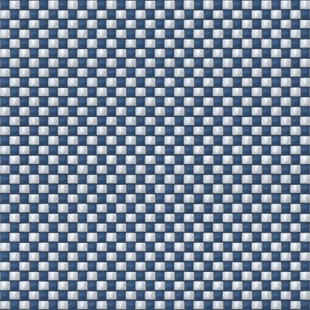

**Plain weave (tabby)** — 1/1 over-under: the base of poplin, canvas, chambray and linen. Different warp/weft colours give a chambray / iridescent look; raise slubs + heather for linen.

- tags: clothes, cotton, shirting, canvas, linen, chambray
- scale: `repeats` (default tile holds 32×32 threads)
- render: ~396 ms
- presets: `chambray`, `linen`, `canvas`

| param | type | default | range / options | notes |
|---|---|---|---|---|
| `style` | enum | fabric | fabric \| flat \| draft | Style — fabric = shaded 3D yarns; flat = solid colour per crossing (prints, pixel art); draft = black/white weave draft |
| `repeats` | int | 16 | 1 – 128 | Repeats — Pattern repeats across the tile (1 repeat = 2 threads). |
| `yarnGap` | float | 0.12 | 0 – 0.5 | Yarn gap — Fraction of each thread cell left open between yarns. |
| `irregularity` | float | 0.35 | 0 – 1 | Irregularity — Per-yarn tone and thickness variation. |
| `twist` | float | 0.5 | 0 – 1 | Fibre twist — Strength of the twisted-fibre striation on each yarn. |
| `sheen` ⁺ | float | 0.08 | 0 – 1 | Sheen — Glossy highlight along the yarns (silk/satin ≈ 0.6). |
| `slub` ⁺ | float | 0.15 | 0 – 1 | Slubs — Thick-and-thin yarn (linen, raw silk). |
| `heather` ⁺ | float | 0 | 0 – 1 | Heather — Mottled multi-tone fibres (marl / melange yarn). |
| `fuzz` ⁺ | float | 0 | 0 – 1 | Brushed fuzz — Brushed / napped surface that softens the weave (flannel, brushed cotton). |
| `seed` | seed | 1 |  | Seed — Same seed + params = identical output, always. Change it for a different random variation. |
| `warp` | color | #3d5a80 |  | Warp colour |
| `weft` | color | #e0e6ee |  | Weft colour |

 

### twill

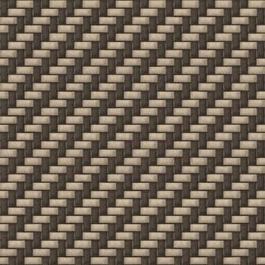

**Twill** — Diagonal-rib weave. 2/2 = gabardine/serge, 3/1 = denim/drill, 2/1 = chino. S or Z diagonal.

- tags: clothes, denim, gabardine, chino, suiting, drill
- scale: `repeats` (default tile holds 32×32 threads)
- render: ~335 ms
- presets: `gabardine`, `chino`, `twill-3-1-s`

| param | type | default | range / options | notes |
|---|---|---|---|---|
| `style` | enum | fabric | fabric \| flat \| draft | Style — fabric = shaded 3D yarns; flat = solid colour per crossing (prints, pixel art); draft = black/white weave draft |
| `repeats` | int | 8 | 1 – 64 | Repeats |
| `yarnGap` | float | 0.12 | 0 – 0.5 | Yarn gap — Fraction of each thread cell left open between yarns. |
| `irregularity` | float | 0.35 | 0 – 1 | Irregularity — Per-yarn tone and thickness variation. |
| `twist` | float | 0.5 | 0 – 1 | Fibre twist — Strength of the twisted-fibre striation on each yarn. |
| `sheen` ⁺ | float | 0.08 | 0 – 1 | Sheen — Glossy highlight along the yarns (silk/satin ≈ 0.6). |
| `slub` ⁺ | float | 0.15 | 0 – 1 | Slubs — Thick-and-thin yarn (linen, raw silk). |
| `heather` ⁺ | float | 0 | 0 – 1 | Heather — Mottled multi-tone fibres (marl / melange yarn). |
| `fuzz` ⁺ | float | 0 | 0 – 1 | Brushed fuzz — Brushed / napped surface that softens the weave (flannel, brushed cotton). |
| `seed` | seed | 1 |  | Seed — Same seed + params = identical output, always. Change it for a different random variation. |
| `over` | int | 2 | 1 – 6 | Over (warp up) |
| `under` | int | 2 | 1 – 6 | Under (warp down) |
| `direction` | enum | Z | Z \| S | Diagonal — Z rises to the right, S to the left. |
| `warp` | color | #4a3f35 |  | Warp colour |
| `weft` | color | #b9a88f |  | Weft colour |

 

### satin

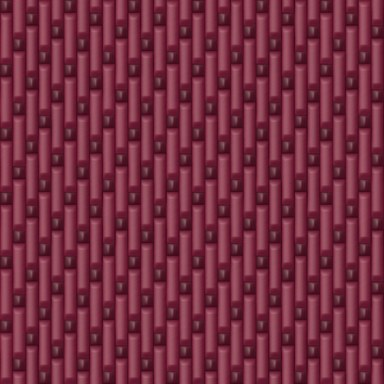

**Satin** — Long floats with scattered interlacings: a smooth, lustrous face. Regular satin needs a move number coprime to the shaft count, so 6 shafts is not offered.

- tags: clothes, silk, lining, luxury, evening
- scale: `repeats` (default tile holds 30×30 threads)
- render: ~338 ms
- presets: `silk-satin`, `satin-weft-face`

| param | type | default | range / options | notes |
|---|---|---|---|---|
| `style` | enum | fabric | fabric \| flat \| draft | Style — fabric = shaded 3D yarns; flat = solid colour per crossing (prints, pixel art); draft = black/white weave draft |
| `repeats` | int | 6 | 1 – 64 | Repeats |
| `yarnGap` | float | 0.03 | 0 – 0.5 | Yarn gap |
| `irregularity` | float | 0.35 | 0 – 1 | Irregularity — Per-yarn tone and thickness variation. |
| `twist` | float | 0.15 | 0 – 1 | Fibre twist |
| `sheen` | float | 0.7 | 0 – 1 | Sheen — Glossy highlight along the floats. |
| `slub` ⁺ | float | 0.15 | 0 – 1 | Slubs — Thick-and-thin yarn (linen, raw silk). |
| `heather` ⁺ | float | 0 | 0 – 1 | Heather — Mottled multi-tone fibres (marl / melange yarn). |
| `fuzz` ⁺ | float | 0 | 0 – 1 | Brushed fuzz — Brushed / napped surface that softens the weave (flannel, brushed cotton). |
| `seed` | seed | 1 |  | Seed — Same seed + params = identical output, always. Change it for a different random variation. |
| `shafts` | enum | 5 | 5 \| 7 \| 8 \| 10 \| 12 | Shafts |
| `face` | enum | warp | warp \| weft | Face |
| `warp` | color | #7b1e3a |  | Warp colour |
| `weft` | color | #5a1429 |  | Weft colour |

 

### basket-weave

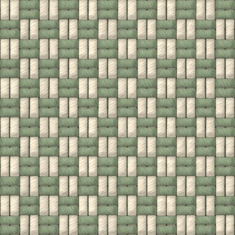

**Basket / hopsack / oxford** — Plain weave with k threads acting as one (2 = hopsack; white weft on a coloured warp = oxford cloth).

- tags: clothes, oxford, hopsack, upholstery, shirting
- scale: `repeats` (default tile holds 24×24 threads)
- render: ~307 ms
- presets: `oxford-cloth`

| param | type | default | range / options | notes |
|---|---|---|---|---|
| `style` | enum | fabric | fabric \| flat \| draft | Style — fabric = shaded 3D yarns; flat = solid colour per crossing (prints, pixel art); draft = black/white weave draft |
| `repeats` | int | 6 | 1 – 64 | Repeats |
| `yarnGap` | float | 0.12 | 0 – 0.5 | Yarn gap — Fraction of each thread cell left open between yarns. |
| `irregularity` | float | 0.35 | 0 – 1 | Irregularity — Per-yarn tone and thickness variation. |
| `twist` | float | 0.5 | 0 – 1 | Fibre twist — Strength of the twisted-fibre striation on each yarn. |
| `sheen` ⁺ | float | 0.08 | 0 – 1 | Sheen — Glossy highlight along the yarns (silk/satin ≈ 0.6). |
| `slub` ⁺ | float | 0.15 | 0 – 1 | Slubs — Thick-and-thin yarn (linen, raw silk). |
| `heather` ⁺ | float | 0 | 0 – 1 | Heather — Mottled multi-tone fibres (marl / melange yarn). |
| `fuzz` ⁺ | float | 0 | 0 – 1 | Brushed fuzz — Brushed / napped surface that softens the weave (flannel, brushed cotton). |
| `seed` | seed | 1 |  | Seed — Same seed + params = identical output, always. Change it for a different random variation. |
| `group` | int | 2 | 2 – 6 | Threads per group |
| `warp` | color | #e7dcc5 |  | Warp |
| `weft` | color | #8a9a7b |  | Weft |

 

### herringbone

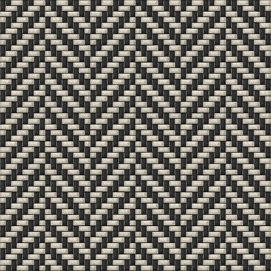

**Herringbone twill** — 2/2 twill whose diagonal reverses every N ends with a half-step offset ("broken" twill), giving the classic fish-bone zigzag.

- tags: clothes, tweed, coat, suiting, classic
- scale: `repeats` (default tile holds 48×48 threads)
- render: ~400 ms
- presets: `herringbone-tweed`, `herringbone-draft`

| param | type | default | range / options | notes |
|---|---|---|---|---|
| `style` | enum | fabric | fabric \| flat \| draft | Style — fabric = shaded 3D yarns; flat = solid colour per crossing (prints, pixel art); draft = black/white weave draft |
| `repeats` | int | 3 | 1 – 32 | Repeats |
| `yarnGap` | float | 0.12 | 0 – 0.5 | Yarn gap — Fraction of each thread cell left open between yarns. |
| `irregularity` | float | 0.35 | 0 – 1 | Irregularity — Per-yarn tone and thickness variation. |
| `twist` | float | 0.5 | 0 – 1 | Fibre twist — Strength of the twisted-fibre striation on each yarn. |
| `sheen` ⁺ | float | 0.08 | 0 – 1 | Sheen — Glossy highlight along the yarns (silk/satin ≈ 0.6). |
| `slub` ⁺ | float | 0.15 | 0 – 1 | Slubs — Thick-and-thin yarn (linen, raw silk). |
| `heather` ⁺ | float | 0.25 | 0 – 1 | Heather |
| `fuzz` ⁺ | float | 0 | 0 – 1 | Brushed fuzz — Brushed / napped surface that softens the weave (flannel, brushed cotton). |
| `seed` | seed | 1 |  | Seed — Same seed + params = identical output, always. Change it for a different random variation. |
| `band` | int | 8 | 2 – 32 | Ends per band |
| `broken` ⁺ | bool | true |  | Broken reversal — Offset the twill at each reversal (real herringbone). Off = plain zigzag. |
| `warp` | color | #2b2b2b |  | Warp |
| `weft` | color | #cfc8b8 |  | Weft |

 

### houndstooth

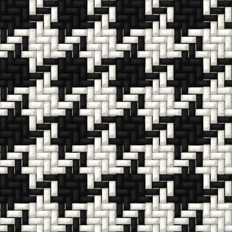

**Houndstooth** — Colour-and-weave effect: 2/2 twill with 4 dark / 4 light in both warp and weft. Band 2 = puppytooth, band 8 = large dogtooth. Use style=flat for a crisp printed version.

- tags: clothes, tweed, check, classic, print
- scale: `repeats` (default tile holds 32×32 threads)
- render: ~390 ms
- presets: `dogtooth-large`, `puppytooth`, `houndstooth-print`

| param | type | default | range / options | notes |
|---|---|---|---|---|
| `style` | enum | fabric | fabric \| flat \| draft | Style — fabric = shaded 3D yarns; flat = solid colour per crossing (prints, pixel art); draft = black/white weave draft |
| `repeats` | int | 4 | 1 – 32 | Repeats |
| `yarnGap` | float | 0.12 | 0 – 0.5 | Yarn gap — Fraction of each thread cell left open between yarns. |
| `irregularity` | float | 0.35 | 0 – 1 | Irregularity — Per-yarn tone and thickness variation. |
| `twist` | float | 0.5 | 0 – 1 | Fibre twist — Strength of the twisted-fibre striation on each yarn. |
| `sheen` ⁺ | float | 0.08 | 0 – 1 | Sheen — Glossy highlight along the yarns (silk/satin ≈ 0.6). |
| `slub` ⁺ | float | 0.15 | 0 – 1 | Slubs — Thick-and-thin yarn (linen, raw silk). |
| `heather` ⁺ | float | 0 | 0 – 1 | Heather — Mottled multi-tone fibres (marl / melange yarn). |
| `fuzz` ⁺ | float | 0 | 0 – 1 | Brushed fuzz — Brushed / napped surface that softens the weave (flannel, brushed cotton). |
| `seed` | seed | 1 |  | Seed — Same seed + params = identical output, always. Change it for a different random variation. |
| `band` | int | 4 | 1 – 16 | Threads per colour band |
| `colors` | colors | #151515, #f2efe6 | 2–2 colours | Dark, light |

 

### pick-and-pick

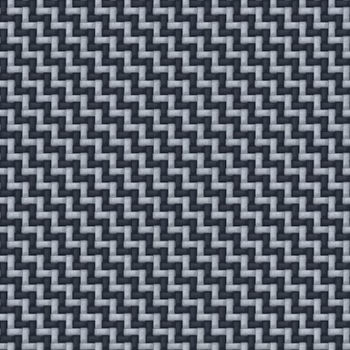

**Pick-and-pick / sharkskin** — 2/2 twill with alternating 1 dark / 1 light warp and weft — the stepped sharkskin texture of suiting.

- tags: clothes, suiting
- scale: `repeats` (default tile holds 48×48 threads)
- render: ~428 ms
- presets: `sharkskin-navy`

| param | type | default | range / options | notes |
|---|---|---|---|---|
| `style` | enum | fabric | fabric \| flat \| draft | Style — fabric = shaded 3D yarns; flat = solid colour per crossing (prints, pixel art); draft = black/white weave draft |
| `repeats` | int | 12 | 1 – 64 | Repeats |
| `yarnGap` | float | 0.12 | 0 – 0.5 | Yarn gap — Fraction of each thread cell left open between yarns. |
| `irregularity` | float | 0.35 | 0 – 1 | Irregularity — Per-yarn tone and thickness variation. |
| `twist` | float | 0.5 | 0 – 1 | Fibre twist — Strength of the twisted-fibre striation on each yarn. |
| `sheen` ⁺ | float | 0.08 | 0 – 1 | Sheen — Glossy highlight along the yarns (silk/satin ≈ 0.6). |
| `slub` ⁺ | float | 0.15 | 0 – 1 | Slubs — Thick-and-thin yarn (linen, raw silk). |
| `heather` ⁺ | float | 0 | 0 – 1 | Heather — Mottled multi-tone fibres (marl / melange yarn). |
| `fuzz` ⁺ | float | 0 | 0 – 1 | Brushed fuzz — Brushed / napped surface that softens the weave (flannel, brushed cotton). |
| `seed` | seed | 1 |  | Seed — Same seed + params = identical output, always. Change it for a different random variation. |
| `colors` | colors | #2d3440, #a9b1bc | 2–2 colours | Dark, light |

 

### glen-check

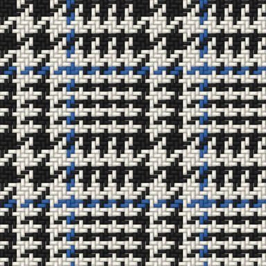

**Glen check / Prince of Wales** — 2/2 twill alternating a houndstooth block (4&4) with a hairline block (2&2) in warp and weft; optional coloured overcheck.

- tags: clothes, suiting, check, classic
- scale: `repeats` (default tile holds 64×64 threads)
- render: ~390 ms
- presets: `prince-of-wales-brown`

| param | type | default | range / options | notes |
|---|---|---|---|---|
| `style` | enum | fabric | fabric \| flat \| draft | Style — fabric = shaded 3D yarns; flat = solid colour per crossing (prints, pixel art); draft = black/white weave draft |
| `repeats` | int | 2 | 1 – 16 | Repeats |
| `yarnGap` | float | 0.12 | 0 – 0.5 | Yarn gap — Fraction of each thread cell left open between yarns. |
| `irregularity` | float | 0.35 | 0 – 1 | Irregularity — Per-yarn tone and thickness variation. |
| `twist` | float | 0.5 | 0 – 1 | Fibre twist — Strength of the twisted-fibre striation on each yarn. |
| `sheen` ⁺ | float | 0.08 | 0 – 1 | Sheen — Glossy highlight along the yarns (silk/satin ≈ 0.6). |
| `slub` ⁺ | float | 0.15 | 0 – 1 | Slubs — Thick-and-thin yarn (linen, raw silk). |
| `heather` ⁺ | float | 0 | 0 – 1 | Heather — Mottled multi-tone fibres (marl / melange yarn). |
| `fuzz` ⁺ | float | 0 | 0 – 1 | Brushed fuzz — Brushed / napped surface that softens the weave (flannel, brushed cotton). |
| `seed` | seed | 1 |  | Seed — Same seed + params = identical output, always. Change it for a different random variation. |
| `colors` | colors | #1f1f1f, #ece8dd | 2–2 colours | Dark, light |
| `overcheck` | bool | true |  | Overcheck |
| `overcheckColor` | color | #2f5e9e |  | Overcheck colour |

 

### gingham

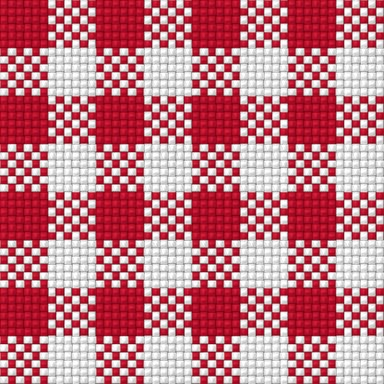

**Gingham** — Plain weave, equal coloured and white bands in warp and weft; the crossings of colour × white give the characteristic mid-tone. Use style=flat at small sizes for a print-style check.

- tags: clothes, shirt, picnic, check, summer
- scale: `repeats` (default tile holds 48×48 threads)
- render: ~452 ms
- presets: `gingham-navy`, `gingham-print`

| param | type | default | range / options | notes |
|---|---|---|---|---|
| `style` | enum | fabric | fabric \| flat \| draft | Style — fabric = shaded 3D yarns; flat = solid colour per crossing (prints, pixel art); draft = black/white weave draft |
| `repeats` | int | 4 | 1 – 32 | Repeats |
| `yarnGap` | float | 0.12 | 0 – 0.5 | Yarn gap — Fraction of each thread cell left open between yarns. |
| `irregularity` | float | 0.35 | 0 – 1 | Irregularity — Per-yarn tone and thickness variation. |
| `twist` | float | 0.5 | 0 – 1 | Fibre twist — Strength of the twisted-fibre striation on each yarn. |
| `sheen` ⁺ | float | 0.08 | 0 – 1 | Sheen — Glossy highlight along the yarns (silk/satin ≈ 0.6). |
| `slub` ⁺ | float | 0.15 | 0 – 1 | Slubs — Thick-and-thin yarn (linen, raw silk). |
| `heather` ⁺ | float | 0 | 0 – 1 | Heather — Mottled multi-tone fibres (marl / melange yarn). |
| `fuzz` ⁺ | float | 0 | 0 – 1 | Brushed fuzz — Brushed / napped surface that softens the weave (flannel, brushed cotton). |
| `seed` | seed | 1 |  | Seed — Same seed + params = identical output, always. Change it for a different random variation. |
| `band` | int | 6 | 1 – 32 | Threads per band |
| `colors` | colors | #c8102e, #ffffff | 2–2 colours | Colour, ground |

 

### tartan

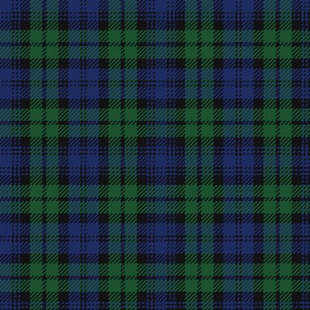

**Tartan / plaid (threadcount)** — Renders any tartan from a threadcount like "K4 R24 K24 Y4" (letters = colours, numbers = threads). Symmetric setts mirror about the pivots. Woven in 2/2 twill so crossing blocks blend like real cloth; raise "Brushed fuzz" for flannel.

- tags: clothes, plaid, kilt, flannel, check, lumberjack
- scale: `repeats` (default tile holds 308×308 threads)
- render: ~417 ms
- presets: `tartan-black-watch`, `tartan-red-stewart`, `buffalo-check`, `flannel-plaid`, `camel-check`, `madras`, `tartan-custom-hex`

| param | type | default | range / options | notes |
|---|---|---|---|---|
| `style` | enum | fabric | fabric \| flat \| draft | Style — fabric = shaded 3D yarns; flat = solid colour per crossing (prints, pixel art); draft = black/white weave draft |
| `repeats` | int | 1 | 1 – 16 | Repeats — Setts across the tile. |
| `yarnGap` | float | 0.06 | 0 – 0.5 | Yarn gap |
| `irregularity` | float | 0.35 | 0 – 1 | Irregularity — Per-yarn tone and thickness variation. |
| `twist` | float | 0.5 | 0 – 1 | Fibre twist — Strength of the twisted-fibre striation on each yarn. |
| `sheen` ⁺ | float | 0.08 | 0 – 1 | Sheen — Glossy highlight along the yarns (silk/satin ≈ 0.6). |
| `slub` ⁺ | float | 0.15 | 0 – 1 | Slubs — Thick-and-thin yarn (linen, raw silk). |
| `heather` ⁺ | float | 0 | 0 – 1 | Heather — Mottled multi-tone fibres (marl / melange yarn). |
| `fuzz` ⁺ | float | 0 | 0 – 1 | Brushed fuzz — Brushed / napped surface that softens the weave (flannel, brushed cotton). |
| `seed` | seed | 1 |  | Seed — Same seed + params = identical output, always. Change it for a different random variation. |
| `sett` | enum | black-watch | black-watch \| simple-green \| four-colour \| buffalo-check \| red-stewart-style \| camel-check-style \| grey-flannel-style \| madras-style \| custom | Sett — A named threadcount, or "custom" to use the threadcount below. |
| `threadcount` | string | K4 R24 K24 Y4 |  | Threadcount (when sett = custom) — Letters: K W R DR B DB LB A G DG LG Y N LN P T O C M S CA, or #rrggbb/N |
| `symmetric` | bool | true |  | Symmetric sett — Mirror the threadcount about its pivots (most tartans). |
| `countScale` | float | 0.5 | 0.1 – 4 | Thread scale — Multiplies every count: smaller = fewer, thicker threads per sett. |

 

### denim

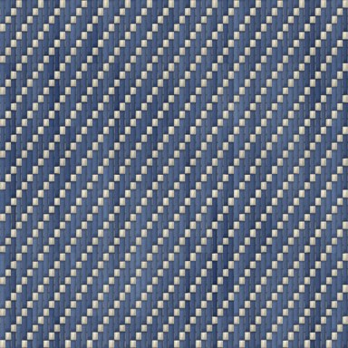

**Denim** — 3/1 right-hand (Z) twill with more ends than picks (steep twill line), ring-spun indigo warp with slubs and tone variation, ecru weft, optional fade/wash.

- tags: clothes, jeans, workwear, indigo
- scale: `repeats` (default tile holds 64×44 threads)
- render: ~937 ms
- presets: `raw-denim`, `stonewash-denim`

| param | type | default | range / options | notes |
|---|---|---|---|---|
| `style` | enum | fabric | fabric \| flat \| draft | Style — fabric = shaded 3D yarns; flat = solid colour per crossing (prints, pixel art); draft = black/white weave draft |
| `repeats` | int | 16 | 1 – 64 | Repeats |
| `yarnGap` | float | 0.08 | 0 – 0.5 | Yarn gap |
| `irregularity` | float | 0.7 | 0 – 1 | Irregularity |
| `twist` | float | 0.5 | 0 – 1 | Fibre twist — Strength of the twisted-fibre striation on each yarn. |
| `sheen` ⁺ | float | 0.08 | 0 – 1 | Sheen — Glossy highlight along the yarns (silk/satin ≈ 0.6). |
| `slub` ⁺ | float | 0.35 | 0 – 1 | Slubs |
| `heather` ⁺ | float | 0 | 0 – 1 | Heather — Mottled multi-tone fibres (marl / melange yarn). |
| `fuzz` ⁺ | float | 0 | 0 – 1 | Brushed fuzz — Brushed / napped surface that softens the weave (flannel, brushed cotton). |
| `seed` | seed | 1 |  | Seed — Same seed + params = identical output, always. Change it for a different random variation. |
| `direction` | enum | Z | Z \| S | Twill direction — Z = right-hand (most jeans), S = left-hand. |
| `indigo` | color | #1f3561 |  | Indigo warp |
| `weft` | color | #d9d2c0 |  | Weft |
| `wash` | float | 0.35 | 0 – 1 | Wash / fade — Low-frequency fading and whiskering. |

 

### tweed

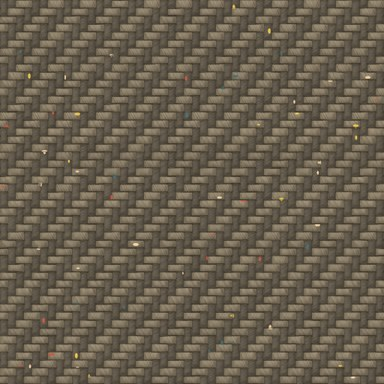

**Tweed (Donegal / Harris)** — Heathered woollen yarns in a 2/2 twill or herringbone, flecked with coloured neps (Donegal). Rough, hairy, multi-tone.

- tags: clothes, wool, coat, jacket, country, heritage
- scale: `repeats` (default tile holds 48×48 threads)
- render: ~967 ms
- presets: `donegal-grey`, `harris-herringbone`

| param | type | default | range / options | notes |
|---|---|---|---|---|
| `style` | enum | fabric | fabric \| flat \| draft | Style — fabric = shaded 3D yarns; flat = solid colour per crossing (prints, pixel art); draft = black/white weave draft |
| `repeats` | int | 12 | 1 – 48 | Repeats |
| `yarnGap` | float | 0.12 | 0 – 0.5 | Yarn gap — Fraction of each thread cell left open between yarns. |
| `irregularity` | float | 0.6 | 0 – 1 | Irregularity |
| `twist` | float | 0.5 | 0 – 1 | Fibre twist — Strength of the twisted-fibre striation on each yarn. |
| `sheen` ⁺ | float | 0.08 | 0 – 1 | Sheen — Glossy highlight along the yarns (silk/satin ≈ 0.6). |
| `slub` ⁺ | float | 0.4 | 0 – 1 | Slubs |
| `heather` | float | 0.6 | 0 – 1 | Heather |
| `fuzz` ⁺ | float | 0.15 | 0 – 1 | Brushed fuzz |
| `seed` | seed | 1 |  | Seed — Same seed + params = identical output, always. Change it for a different random variation. |
| `weave` | enum | twill | twill \| herringbone \| plain | Weave |
| `warp` | color | #5b5346 |  | Warp |
| `weft` | color | #8a7d66 |  | Weft |
| `neps` | float | 0.35 | 0 – 1 | Neps (flecks) — Density of coloured flecks. |
| `nepColors` | colors | #c8553d, #f2d0a4, #3c6e71, #e8c547 | 1–16 colours | Fleck colours |

 

### weave-draft

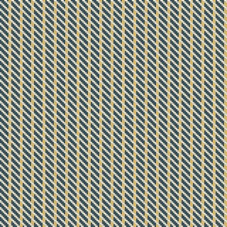

**Custom weave draft** — Any dobby structure from a draft string: rows = picks separated by "/", 1 = warp up. Colour orders as colour lists with thread counts. Presets include waffle, bird's-eye and diamond twill.

- tags: clothes, jacquard, dobby, custom, waffle
- scale: `repeats` (default tile holds 160×160 threads)
- render: ~445 ms
- presets: `waffle-weave`, `birdseye`, `diamond-twill`

| param | type | default | range / options | notes |
|---|---|---|---|---|
| `style` | enum | fabric | fabric \| flat \| draft | Style — fabric = shaded 3D yarns; flat = solid colour per crossing (prints, pixel art); draft = black/white weave draft |
| `repeats` | int | 4 | 1 – 64 | Repeats |
| `yarnGap` | float | 0.12 | 0 – 0.5 | Yarn gap — Fraction of each thread cell left open between yarns. |
| `irregularity` | float | 0.35 | 0 – 1 | Irregularity — Per-yarn tone and thickness variation. |
| `twist` | float | 0.5 | 0 – 1 | Fibre twist — Strength of the twisted-fibre striation on each yarn. |
| `sheen` ⁺ | float | 0.08 | 0 – 1 | Sheen — Glossy highlight along the yarns (silk/satin ≈ 0.6). |
| `slub` ⁺ | float | 0.15 | 0 – 1 | Slubs — Thick-and-thin yarn (linen, raw silk). |
| `heather` ⁺ | float | 0 | 0 – 1 | Heather — Mottled multi-tone fibres (marl / melange yarn). |
| `fuzz` ⁺ | float | 0 | 0 – 1 | Brushed fuzz — Brushed / napped surface that softens the weave (flannel, brushed cotton). |
| `seed` | seed | 1 |  | Seed — Same seed + params = identical output, always. Change it for a different random variation. |
| `draft` | string | 11100/01110/00111/10011/11001 |  | Draft rows — e.g. "1100/0110/0011/1001" = 2/2 twill (max 64×64) |
| `warpColors` | colors | #264653, #e9c46a | 1–16 colours | Warp colour order |
| `warpCounts` | string | 6 2 |  | Warp counts — Threads per colour, space separated (cycled). |
| `weftColors` | colors | #f4f1de | 1–16 colours | Weft colour order |
| `weftCounts` | string | 1 |  | Weft counts |

 

## knit

### knit

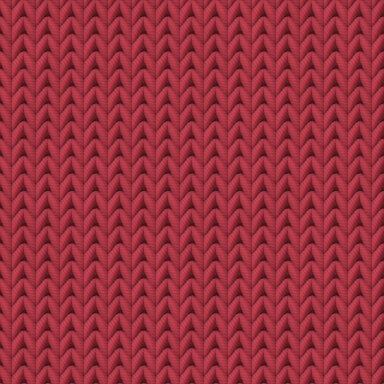

**Knit stitches** — Stockinette/jersey, garter, ribs, seed, moss, basketweave, welting, diamond brocade — interlocking V stitches and purl bumps with real depth (purl columns recede in ribs).

- tags: clothes, sweater, jersey, wool, rib, beanie
- scale: `stitchesAcross` (default tile holds 16×22 stitches)
- render: ~858 ms
- presets: `rib-2x2-navy`, `seed-stitch`, `garter-stitch`, `knit-basketweave`, `diamond-brocade`, `fine-jersey`

| param | type | default | range / options | notes |
|---|---|---|---|---|
| `stitchesAcross` | int | 16 | 2 – 256 | Stitches across tile — Higher = finer knit. |
| `gauge` ⁺ | float | 1.36 | 0.6 – 2.5 | Rows per stitch width — Row/stitch gauge ratio (≈30 rows / 22 sts per 10 cm). |
| `yarnRadius` | float | 0.25 | 0.14 – 0.34 | Yarn thickness — Thicker yarn closes the gaps between loops. |
| `irregularity` | float | 0.4 | 0 – 1 | Irregularity — Stitch-to-stitch tone variation (hand-knit look). |
| `fuzz` ⁺ | float | 0.35 | 0 – 1 | Fibre fuzz — Ply striations and hairiness of the yarn. |
| `seed` | seed | 3 |  | Seed — Same seed + params = identical output, always. Change it for a different random variation. |
| `stitch` | enum | stockinette | stockinette \| reverse-stockinette \| garter \| rib-1x1 \| rib-2x2 \| rib-3x1 \| seed \| moss \| basketweave \| broken-rib \| welting \| diamond-brocade | Stitch pattern |
| `color` | color | #b23a48 |  | Yarn colour |

 

### fair-isle

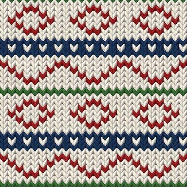

**Fair Isle / jacquard knit** — Stockinette colourwork from a chart: rows separated by "/", digits index the palette (0 = background). Built-in charts: bands, snowflake, hearts, trees, diamonds…

- tags: clothes, sweater, nordic, christmas, colourwork, jacquard
- scale: `stitchesAcross` (default tile holds 24×34 stitches)
- render: ~861 ms
- presets: `nordic-snowflake`, `christmas-trees`, `fair-isle-hearts`

| param | type | default | range / options | notes |
|---|---|---|---|---|
| `stitchesAcross` | int | 24 | 2 – 256 | Stitches across tile |
| `gauge` ⁺ | float | 1.36 | 0.6 – 2.5 | Rows per stitch width — Row/stitch gauge ratio (≈30 rows / 22 sts per 10 cm). |
| `yarnRadius` | float | 0.25 | 0.14 – 0.34 | Yarn thickness — Thicker yarn closes the gaps between loops. |
| `irregularity` | float | 0.4 | 0 – 1 | Irregularity — Stitch-to-stitch tone variation (hand-knit look). |
| `fuzz` ⁺ | float | 0.35 | 0 – 1 | Fibre fuzz — Ply striations and hairiness of the yarn. |
| `seed` | seed | 3 |  | Seed — Same seed + params = identical output, always. Change it for a different random variation. |
| `chart` | enum | fair-isle-band | none \| diamonds \| zigzag \| fair-isle-band \| snowflake \| hearts \| trees \| checks \| stripes \| custom | Chart |
| `customChart` | string | 0110/1001/1001/0110 |  | Custom chart — Rows of digits separated by "/" (max 128×128). |
| `colors` | colors | #f1ebdd, #9b1d20, #1d3557, #3a6b35 | 1–10 colours | Palette (0,1,2,3…) |

 

### cable-knit

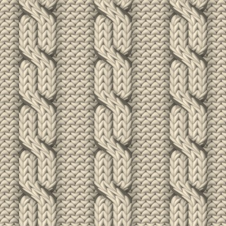

**Cable knit (aran)** — Rope cables (2 strands) or braids (3 strands) of stockinette crossing every N rows, raised over a reverse-stockinette or seed-stitch ground, with depth shading and cast shadows.

- tags: clothes, sweater, aran, fisherman, wool, chunky
- scale: `stitchesAcross` (default tile holds 24×30 stitches)
- render: ~818 ms
- presets: `aran-sweater`, `braid-cable`, `chunky-cable-seed`

| param | type | default | range / options | notes |
|---|---|---|---|---|
| `stitchesAcross` | int | 24 | 8 – 256 | Stitches across tile |
| `gauge` ⁺ | float | 1.36 | 0.6 – 2.5 | Rows per stitch width — Row/stitch gauge ratio (≈30 rows / 22 sts per 10 cm). |
| `yarnRadius` | float | 0.27 | 0.14 – 0.34 | Yarn thickness |
| `irregularity` | float | 0.4 | 0 – 1 | Irregularity — Stitch-to-stitch tone variation (hand-knit look). |
| `fuzz` ⁺ | float | 0.35 | 0 – 1 | Fibre fuzz — Ply striations and hairiness of the yarn. |
| `seed` | seed | 3 |  | Seed — Same seed + params = identical output, always. Change it for a different random variation. |
| `cable` | enum | rope | rope \| braid \| mixed | Cable type — mixed = rope and braid panels alternating (aran sweater). |
| `crossEvery` | int | 6 | 4 – 16 | Rows between crossings |
| `purlBetween` | int | 2 | 1 – 6 | Ground stitches each side |
| `ground` | enum | reverse-stockinette | reverse-stockinette \| seed | Ground stitch |
| `color` | color | #e8dcc4 |  | Yarn colour |

 

## textile

### corduroy

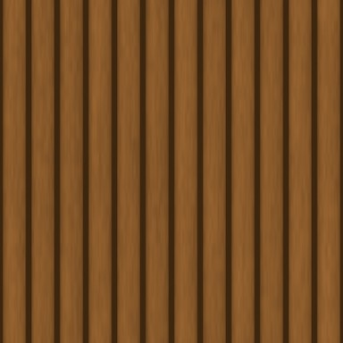

**Corduroy** — Rounded pile wales separated by grooves where the ground weave shows; fine vertical pile fibres with a velvety sheen on the wale shoulders. Wide wale ≈ 8, needlecord ≈ 24 per tile.

- tags: clothes, trousers, jacket, retro, pile
- scale: `wales` (default tile holds 12×12 wales)
- render: ~630 ms
- presets: `needlecord`, `wide-wale-cord`

| param | type | default | range / options | notes |
|---|---|---|---|---|
| `wales` | int | 12 | 2 – 128 | Wales across |
| `groove` | float | 0.2 | 0.04 – 0.5 | Groove width — Fraction of each wale that is groove. |
| `color` | color | #8a5a2b |  | Colour |
| `pile` | float | 0.6 | 0 – 1 | Pile texture |
| `sheen` ⁺ | float | 0.5 | 0 – 1 | Sheen — Velvet highlight across each wale. |
| `wear` ⁺ | float | 0.2 | 0 – 1 | Wear — Low-frequency crushing / fading of the pile. |
| `seed` | seed | 31 |  | Seed — Same seed + params = identical output, always. Change it for a different random variation. |

 

### velvet

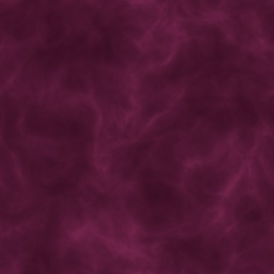

**Velvet / crushed velvet** — Dense short pile: smooth colour with soft shimmering highlights where the pile changes direction. Raise "crush" for crushed / panne velvet.

- tags: clothes, evening, luxury, upholstery, pile, velour
- scale: `scale` (default tile holds 3×3 crush patches)
- render: ~1421 ms
- presets: `crushed-velvet-emerald`, `velvet-midnight`

| param | type | default | range / options | notes |
|---|---|---|---|---|
| `color` | color | #5b1a3a |  | Colour |
| `scale` | int | 3 | 1 – 16 | Crush scale — Number of crush patches across. |
| `crush` | float | 0.55 | 0 – 1 | Crush — Strength of the light/dark patches. |
| `sheen` | float | 0.6 | 0 – 1 | Sheen |
| `seed` | seed | 41 |  | Seed — Same seed + params = identical output, always. Change it for a different random variation. |

 

### quilted

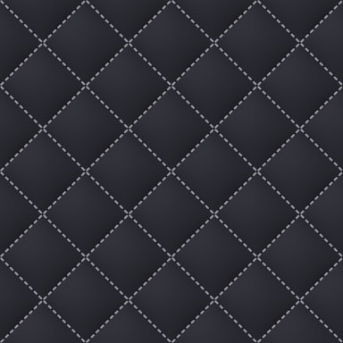

**Quilted / padded / puffer** — Puffy padded cells (diamond, square or puffer channels) with dashed stitch seams; lit from the top-left from the real height field, with a nylon or cotton surface.

- tags: clothes, puffer, jacket, bag, luxury, down
- scale: `cells` (default tile holds 4×4 cells)
- render: ~479 ms
- presets: `puffer-channel`, `quilted-satin-blush`

| param | type | default | range / options | notes |
|---|---|---|---|---|
| `layout` | enum | diamond | diamond \| square \| channel | Layout |
| `cells` | int | 4 | 1 – 32 | Cells across |
| `puff` | float | 0.8 | 0 – 1 | Puffiness |
| `color` | color | #2c2c34 |  | Fabric |
| `stitch` | color | #9a9aa6 |  | Stitch thread |
| `surface` | enum | nylon | nylon \| cotton \| satin | Surface — nylon = ripstop grid + sheen; satin = glossy; cotton = matte weave. |
| `dashes` | int | 9 | 0 – 40 | Stitches per seam (0 = none) |

 

### mesh

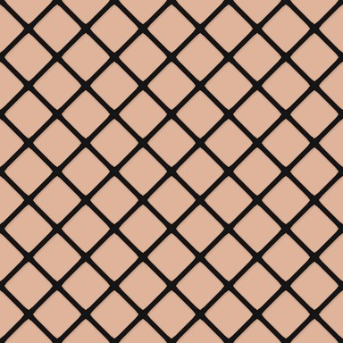

**Mesh / fishnet / tulle** — Open net of round, twisted yarn with knots at the crossings, casting a soft shadow on the backing. Set backing to "transparent" for a see-through net. Diamond fishnet, square net or hexagonal tulle.

- tags: clothes, fishnet, sportswear, lace, net, transparent
- scale: `cells` (default tile holds 6×6 openings)
- render: ~167 ms
- presets: `fishnet`, `tulle-white`

| param | type | default | range / options | notes |
|---|---|---|---|---|
| `layout` | enum | diamond | diamond \| square \| hex | Net shape |
| `cells` | int | 6 | 2 – 64 | Openings across |
| `yarn` | float | 0.09 | 0.02 – 0.3 | Yarn thickness (cell units) |
| `knots` | float | 0.5 | 0 – 1 | Knot size |
| `color` | color | #141414 |  | Yarn |
| `backing` | color | #e0b49a |  | Backing — Use "transparent" for a see-through net. |
| `shadow` ⁺ | float | 0.5 | 0 – 1 | Shadow on backing |

 

### sequins

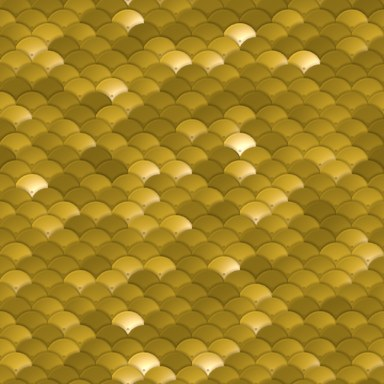

**Sequins / paillettes** — Overlapping metallic discs in staggered rows, each tilted and slightly cupped so it mirrors a studio light differently; centre hole with thread, bevelled rim, shadows from the sequin above. Several colours = mixed sequins.

- tags: clothes, party, glitter, evening, metallic, disco
- scale: `cells` (default tile holds 12×12 sequins)
- render: ~593 ms
- presets: `sequins-silver`, `sequins-rainbow`

| param | type | default | range / options | notes |
|---|---|---|---|---|
| `cells` | int | 12 | 2 – 96 | Sequins across |
| `colors` | colors | #c9a227 | 1–16 colours | Sequin colours (random mix) |
| `sparkle` | float | 0.6 | 0 – 1 | Sparkle |
| `tilt` | float | 0.5 | 0 – 1 | Tilt variation |
| `fabric` ⁺ | color | #1a1a1a |  | Base fabric |
| `seed` | seed | 33 |  | Seed — Same seed + params = identical output, always. Change it for a different random variation. |

 

### cross-stitch

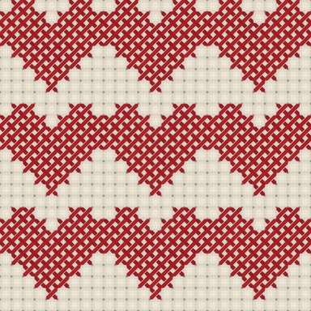

**Cross-stitch / embroidery** — Aida cloth with its woven blocks and holes; chart digits (1-9) are stitched as X crosses of two-strand twisted floss in palette colours, 0 = empty. Pixel-art friendly.

- tags: clothes, embroidery, folk, craft, pixel-art
- scale: `repeats` (default tile holds 27×27 stitches)
- render: ~406 ms
- presets: `cross-stitch-flower`, `cross-stitch-strawberry`

| param | type | default | range / options | notes |
|---|---|---|---|---|
| `chart` | enum | heart | heart \| diamonds \| border \| flower \| strawberry \| custom | Chart |
| `customChart` | string | 0110/1111/0110 |  | Custom chart — Rows of digits separated by "/" (0 = empty, max 64×64). |
| `repeats` | int | 3 | 1 – 32 | Chart repeats |
| `fabric` | color | #efe7d6 |  | Aida |
| `colors` | colors | #b3202a, #2f6d3a, #1f3b73, #d9a21b | 1–16 colours | Thread palette (1,2,3…) |
| `seed` | seed | 35 |  | Seed — Same seed + params = identical output, always. Change it for a different random variation. |

 

### eyelet-lace

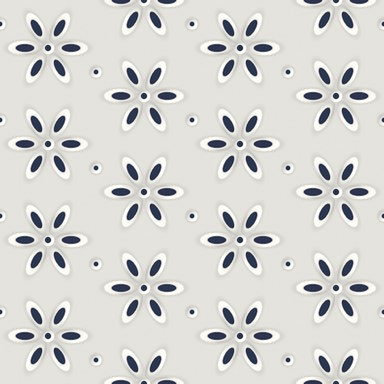

**Eyelet lace (broderie anglaise)** — Cotton lawn with satin-stitched eyelet flowers: petal and round holes with raised, radially stitched rims and tiny dot eyelets between. Set backing to "transparent" for real see-through holes.

- tags: clothes, lace, summer, blouse, cotton, transparent, embroidery
- scale: `cells` (default tile holds 4×4 motifs)
- render: ~959 ms
- presets: `eyelet-see-through`

| param | type | default | range / options | notes |
|---|---|---|---|---|
| `cells` | int | 4 | 1 – 24 | Flowers across |
| `petals` | int | 6 | 4 – 9 | Petals |
| `holeSize` | float | 0.5 | 0.2 – 1 | Hole size |
| `color` | color | #f7f5ef |  | Cloth & thread |
| `backing` | color | #2a3550 |  | Backing — What shows through the holes; "transparent" for see-through. |
| `dots` | bool | true |  | Dot eyelets between flowers |
| `seed` | seed | 43 |  | Seed — Same seed + params = identical output, always. Change it for a different random variation. |

 

### shibori

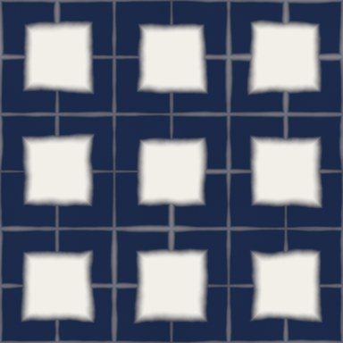

**Shibori / tie-dye** — Resist-dye looks on woven cotton: itajime (clamped shapes + fold lines), arashi (pole-wrapped diagonal storm lines), kumo (spider-web bound circles), tie-dye spiral. Dye wicks along the weave, so edges feather along warp and weft.

- tags: clothes, indigo, tie-dye, japanese, boho, resist-dye
- scale: `cells` (default tile holds 3×3 repeats)
- render: ~1366 ms
- presets: `shibori-arashi`, `shibori-kumo`, `tie-dye-spiral`

| param | type | default | range / options | notes |
|---|---|---|---|---|
| `style` | enum | itajime | itajime \| arashi \| kumo \| spiral | Technique |
| `cells` | int | 3 | 1 – 32 | Repeats |
| `shape` | enum | square | square \| circle \| triangle | Itajime shape |
| `bleed` | float | 0.5 | 0 – 1 | Dye bleed |
| `colors` | colors | #1b2a4a, #f2efe8 | 2–2 colours | Dye, cloth |
| `seed` | seed | 37 |  | Seed — Same seed + params = identical output, always. Change it for a different random variation. |

 

## geometric

### stripes

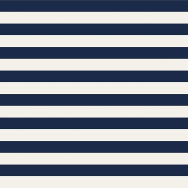

**Stripes** — Any number of coloured bands with relative widths, horizontal/vertical/diagonal, optionally wavy. Pinstripe: widths "1 14". Breton: "1 1.4". Soft = blurred band edges.

- tags: clothes, print, breton, pinstripe, awning, graphics, wavy
- scale: `repeats` (default tile holds 8×8 repeats)
- render: ~142 ms
- presets: `breton`, `pinstripe`, `awning`, `retro-diagonal`, `wavy-candy`

| param | type | default | range / options | notes |
|---|---|---|---|---|
| `colors` | colors | #1b2a49, #f4f1ea | 1–16 colours | Band colours (cycled) |
| `widths` | string | 1 1 |  | Relative widths — Space-separated, one per band (cycled to match colours). |
| `direction` | enum | horizontal | horizontal \| vertical \| diagonal \| anti-diagonal \| shallow \| steep | Direction |
| `repeats` | int | 8 | 1 – 256 | Repeats |
| `wave` | float | 0 | 0 – 2 | Wave amplitude — In stripe-repeat units; 0 = straight. |
| `waveFreq` | int | 2 | 1 – 32 | Waves across |
| `soft` ⁺ | float | 0 | 0 – 1 | Soft edges |

 

### checkerboard

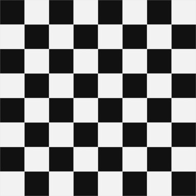

**Checkerboard** — Two-colour checks, square or diagonal (harlequin diamonds). Cell count is forced even so it tiles.

- tags: print, graphics, floor, racing, harlequin, retro
- scale: `cells` (default tile holds 8×8 cells)
- render: ~100 ms
- presets: `harlequin`, `racing-check`

| param | type | default | range / options | notes |
|---|---|---|---|---|
| `cells` | int | 8 | 2 – 256 | Cells across (even) |
| `colors` | colors | #111111, #f2f2f2 | 2–2 colours | Colours |
| `diagonal` | bool | false |  | Diagonal (harlequin) |

 

### dots

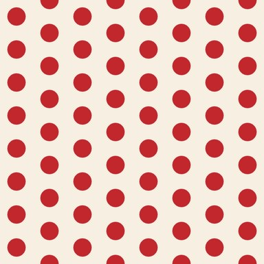

**Polka dots & tossed motifs** — Dots, stars, hearts, flowers, leaves, moons… in textile repeat layouts: block, half-drop, brick or tossed (random, non-overlapping). Optional outline and flower centres make ditsy florals.

- tags: clothes, print, polka, confetti, graphics, kids, ditsy, floral
- scale: `cells` (default tile holds 8×8 cells)
- render: ~1107 ms
- presets: `ditsy-floral`, `tossed-stars`, `hearts-brick`, `rain-drops`, `falling-leaves`, `polka-transparent`

| param | type | default | range / options | notes |
|---|---|---|---|---|
| `layout` | enum | half-drop | block \| half-drop \| brick \| tossed | Repeat layout |
| `shape` | enum | circle | circle \| ring \| square \| diamond \| cross \| star \| heart \| flower \| triangle \| hexagon \| teardrop \| moon \| leaf | Motif |
| `cells` | int | 8 | 2 – 128 | Cells across |
| `size` | float | 0.28 | 0.05 – 0.5 | Motif radius (cell units) |
| `sizeJitter` | float | 0 | 0 – 1 | Size variation |
| `rotate` | bool | false |  | Random rotation |
| `background` | color | #f6efe2 |  | Background — "transparent" for motifs only. |
| `colors` | colors | #c1272d | 1–16 colours | Motif colours (random pick) |
| `outline` ⁺ | float | 0 | 0 – 0.1 | Outline width (cell units) |
| `outlineColor` ⁺ | color | #1d1d1d |  | Outline colour |
| `centerColor` ⁺ | color | transparent |  | Centre dot colour — E.g. yellow flower centres. "transparent" = none. |
| `seed` | seed | 5 |  | Seed — Same seed + params = identical output, always. Change it for a different random variation. |

 

### chevron

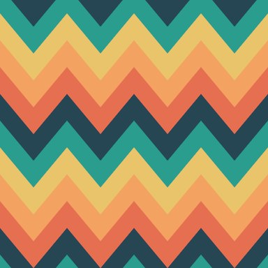

**Chevron / zigzag** — Zigzag bands. Band count is rounded to a multiple of the colour count so colours tile. Rounded = soft wave zigzag.

- tags: clothes, print, missoni, graphics
- scale: `zigs` (default tile holds 4×10 zigzags)
- render: ~161 ms
- presets: `missoni-zigzag`

| param | type | default | range / options | notes |
|---|---|---|---|---|
| `colors` | colors | #264653, #2a9d8f, #e9c46a, #f4a261, #e76f51 | 1–16 colours | Band colours |
| `bands` | int | 10 | 1 – 128 | Bands (vertical) |
| `zigs` | int | 4 | 1 – 64 | Zigzags across |
| `amplitude` | float | 1.5 | 0 – 8 | Amplitude (bands) |
| `rounded` | float | 0 | 0 – 1 | Rounded peaks |

 

### argyle

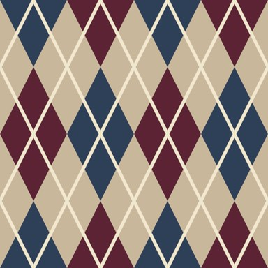

**Argyle** — Alternating diamonds on a ground with thin diagonal overcheck lines (dashed option, like the stitched original).

- tags: clothes, knitwear, socks, golf, preppy
- scale: `cols` (default tile holds 4×2 diamonds)
- render: ~199 ms
- presets: `argyle-golf`

| param | type | default | range / options | notes |
|---|---|---|---|---|
| `cols` | int | 4 | 2 – 64 | Diamonds across (even) |
| `rows` | int | 2 | 2 – 64 | Diamond rows (even) |
| `colors` | colors | #5b2333, #2e4057, #c9b79c | 3–3 colours | Diamond A, diamond B, ground |
| `lineColor` | color | #f2e8cf |  | Overcheck line |
| `lineWidth` | float | 0.012 | 0 – 0.05 | Line width (uv) |
| `dashed` | bool | false |  | Dashed overcheck |

 

### honeycomb

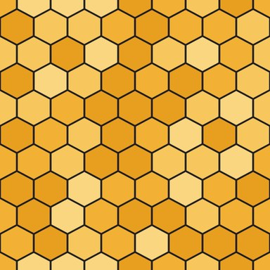

**Hexagon / honeycomb** — Pointy-top hex grid. Vertical rows are chosen so hexes are within a few % of regular on a square tile. Cells, outline-only or bevelled tiles.

- tags: graphics, tiles, sci-fi, mesh, print
- scale: `cells` (default tile holds 8×8 hexes)
- render: ~330 ms
- presets: `honeycomb-bevel`

| param | type | default | range / options | notes |
|---|---|---|---|---|
| `cells` | int | 8 | 1 – 128 | Hexes across |
| `style` | enum | cells | cells \| lines \| bevel | Style |
| `line` | float | 0.06 | 0 – 0.4 | Line width (hex units) |
| `background` | color | #1d1d24 |  | Line / gap colour |
| `colors` | colors | #f2b134, #f7c75e, #e89f1f, #fad681 | 1–16 colours | Cell colours (random) |
| `seed` | seed | 2 |  | Seed — Same seed + params = identical output, always. Change it for a different random variation. |

 

### truchet

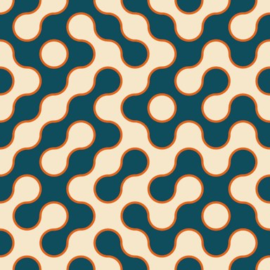

**Truchet tiles** — Smith quarter-circle tiles (2-colourable: colour = inside ⊕ orientation ⊕ parity), 10-PRINT maze, or triangle tiles.

- tags: graphics, maze, generative, print
- scale: `cells` (default tile holds 10×10 tiles)
- render: ~271 ms
- presets: `truchet-maze`, `truchet-triangles`

| param | type | default | range / options | notes |
|---|---|---|---|---|
| `variant` | enum | arcs | arcs \| maze \| triangles | Variant |
| `cells` | int | 10 | 2 – 128 | Tiles across (even) |
| `fill` | bool | true |  | Two-colour fill |
| `lineWidth` | float | 0.08 | 0 – 0.5 | Line width (tile units) |
| `colors` | colors | #0f4c5c, #f6e7cb, #e36414 | 3–3 colours | Colour A, B, line |
| `seed` | seed | 11 |  | Seed — Same seed + params = identical output, always. Change it for a different random variation. |

 

### seigaiha

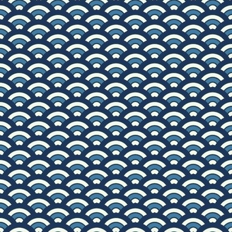

**Seigaiha / scales** — Overlapping concentric half-circles (Japanese wave pattern). Rings alternate through the palette.

- tags: print, japanese, kimono, waves, mermaid, clothes
- scale: `cells` (default tile holds 6×24 scales)
- render: ~256 ms
- presets: `seigaiha-red`

| param | type | default | range / options | notes |
|---|---|---|---|---|
| `cells` | int | 6 | 1 – 64 | Scales across |
| `rings` | int | 4 | 1 – 12 | Rings per scale |
| `colors` | colors | #1d3557, #f1faee, #457b9d, #f1faee | 1–16 colours | Ring colours (outer → inner) |
| `outline` | float | 0.03 | 0 – 0.2 | Outline (scale units) |
| `outlineColor` | color | #1d3557 |  | Outline colour |

 

### ogee

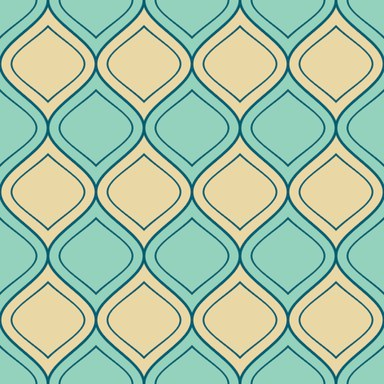

**Ogee lattice** — Interlocking onion shapes. Exact two-family tiling because sin²(πy) + sin²(π(y+½)) = 1. Optional inner outline and centre dot.

- tags: print, damask, wallpaper, moroccan, clothes
- scale: `cols` (default tile holds 4×3 shapes)
- render: ~219 ms
- presets: `moroccan-ogee`

| param | type | default | range / options | notes |
|---|---|---|---|---|
| `cols` | int | 4 | 1 – 64 | Shapes across |
| `rows` | int | 3 | 1 – 64 | Shapes down |
| `colors` | colors | #e9d8a6, #94d2bd | 2–2 colours | Family A, family B |
| `line` | float | 0.03 | 0 – 0.2 | Outline (cell units) |
| `lineColor` | color | #005f73 |  | Outline |
| `inset` | float | 0.12 | 0 – 0.4 | Inner outline inset (0 = off) |
| `dot` ⁺ | float | 0 | 0 – 0.2 | Centre dot size |

 

### islamic-star

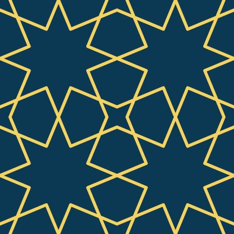

**Islamic star (Hankin)** — Hankin's polygons-in-contact: rays leave each edge midpoint at a contact angle and meet inside the tile. 4.8.8 tiling gives 8-point stars, 6.6.6 gives 6-point stars (hex rows fitted to the square tile), 4.4.4.4 gives crosses.

- tags: print, tiles, moroccan, zellige, graphics, ornament
- scale: `repeats` (default tile holds 2×2 repeats)
- render: ~606 ms
- presets: `islamic-six-star`, `islamic-square-60`

| param | type | default | range / options | notes |
|---|---|---|---|---|
| `tiling` | enum | 4.8.8 | 4.8.8 \| 4.4.4.4 \| 6.6.6 | Underlying tiling |
| `angle` | float | 67.5 | 20 – 85 | Contact angle (deg) |
| `repeats` | int | 2 | 1 – 32 | Repeats |
| `width` | float | 0.035 | 0.002 – 0.15 | Strap width (cell units) |
| `style` | enum | strap | line \| strap | Style |
| `colors` | colors | #0b3954, #f4d35e, #0b3954 | 3–3 colours | Ground, strap, strap edge |

 

### terrazzo

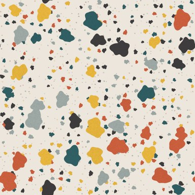

**Terrazzo** — Irregular stone chips at two scales plus fine grit on a speckled ground, with subtle per-chip polish variation.

- tags: graphics, interior, surface, print, stone
- scale: `density` (default tile holds 7×7 chips)
- render: ~1870 ms
- presets: `terrazzo-pastel`

| param | type | default | range / options | notes |
|---|---|---|---|---|
| `density` | int | 7 | 1 – 64 | Large chips across |
| `chipSize` | float | 0.32 | 0.05 – 0.5 | Chip size |
| `background` | color | #ece6dc |  | Ground |
| `colors` | colors | #c75d3c, #2f5d62, #e3b23c, #9aa5a1, #3d3b3c | 1–16 colours | Chip colours |
| `grit` ⁺ | float | 0.5 | 0 – 1 | Fine grit |
| `seed` | seed | 8 |  | Seed — Same seed + params = identical output, always. Change it for a different random variation. |

 

### halftone

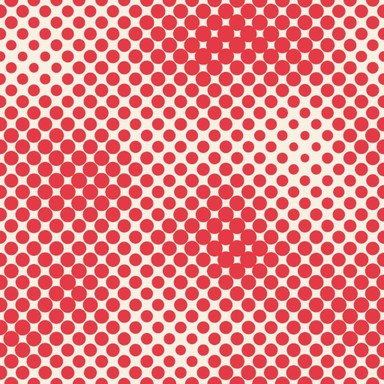

**Halftone screen** — Screen of dots, lines or squares whose size follows a periodic noise / wave / radial field. Screen angles use integer lattice vectors so the tile stays seamless.

- tags: graphics, pop-art, comic, print, retro, risograph
- scale: `cells` (default tile holds 24×24 dots)
- render: ~812 ms
- presets: `halftone-lines`, `halftone-radial`

| param | type | default | range / options | notes |
|---|---|---|---|---|
| `cells` | int | 24 | 4 – 256 | Dots across |
| `angle` | enum | 45° | 0° \| 45° \| 26.6° \| 18.4° | Screen angle |
| `dot` | enum | circle | circle \| line \| square \| diamond | Dot shape |
| `field` | enum | noise | noise \| waves \| radial \| flat | Tone field |
| `tone` | float | 0.5 | 0 – 1 | Tone (flat field) |
| `scale` | int | 2 | 1 – 16 | Field frequency |
| `contrast` | float | 1.4 | 0.2 – 4 | Contrast |
| `colors` | colors | #f7f1e3, #e63946 | 2–2 colours | Paper, ink |
| `seed` | seed | 4 |  | Seed — Same seed + params = identical output, always. Change it for a different random variation. |

 

### contour-lines

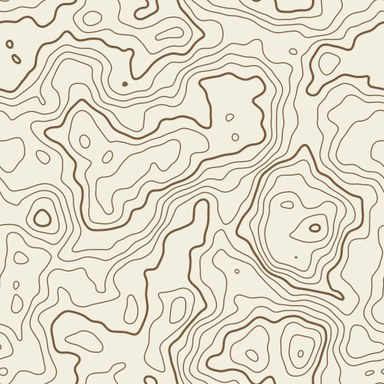

**Topographic contours** — Iso-lines of a periodic fbm field with constant on-screen width (gradient-normalised), thicker index lines every Nth level; optional hypsometric colour fill.

- tags: graphics, map, outdoor, print, abstract
- scale: `levels` (default tile holds 2×2 hills)
- render: ~1386 ms
- presets: `contour-hypsometric`

| param | type | default | range / options | notes |
|---|---|---|---|---|
| `levels` | int | 14 | 2 – 64 | Levels |
| `scale` | int | 2 | 1 – 16 | Field frequency |
| `lineWidth` | float | 1.6 | 0.3 – 6 | Line width (px @512) |
| `indexEvery` | int | 5 | 0 – 20 | Index line every |
| `fill` | bool | false |  | Hypsometric fill |
| `colors` | colors | #f3efe0, #7a5c3e | 2–2 colours | Ground, line |
| `fillColors` | colors | #2b5f4a, #7da36b, #e6d8a6, #c58b4e, #f4efe6 | 1–16 colours | Fill ramp |
| `seed` | seed | 6 |  | Seed — Same seed + params = identical output, always. Change it for a different random variation. |

 

### bricks

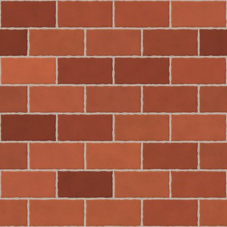

**Bricks / tiles** — Running, stack, Flemish or basket-weave bond with recessed mortar; every brick has its own tone, noisy pitted surface and slightly chipped edges, plus a bevelled height map (good for normal maps).

- tags: graphics, game, wall, material, subway-tile, masonry
- scale: `cols` (default tile holds 4×8 bricks)
- render: ~1335 ms
- presets: `subway-tiles`, `brick-basketweave`, `flemish-bond`

| param | type | default | range / options | notes |
|---|---|---|---|---|
| `bond` | enum | running | running \| stack \| flemish \| basket | Bond |
| `cols` | int | 4 | 1 – 64 | Bricks per row |
| `rows` | int | 8 | 2 – 128 | Rows (even for running) |
| `mortar` | float | 0.06 | 0 – 0.3 | Mortar (brick-height units) |
| `colors` | colors | #9c4a33, #b05a3c, #8a3f2c, #a8553b | 1–16 colours | Brick colours |
| `mortarColor` | color | #cfc6b8 |  | Mortar |
| `roughness` | float | 0.5 | 0 – 1 | Surface noise |
| `chipping` ⁺ | float | 0.4 | 0 – 1 | Edge chipping |
| `seed` | seed | 9 |  | Seed — Same seed + params = identical output, always. Change it for a different random variation. |

 

### grid-paper

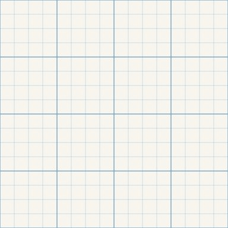

**Grid paper (graph / dot / isometric)** — Graph paper with minor and major lines, dot grid, or isometric (triangular) grid — backgrounds for type specimens, blueprints and notebooks. Lines keep a constant pixel width at any size.

- tags: graphics, paper, notebook, blueprint, technical, typography
- scale: `cells` (default tile holds 16×16 cells)
- render: ~321 ms
- presets: `graph-paper`, `dot-grid`, `blueprint`, `isometric-grid`

| param | type | default | range / options | notes |
|---|---|---|---|---|
| `style` | enum | lines | lines \| dots \| isometric | Style |
| `cells` | int | 16 | 2 – 256 | Cells across |
| `majorEvery` | int | 4 | 0 – 16 | Major line every (0 = none) |
| `lineWidth` | float | 1 | 0.3 – 6 | Line width (px @512) |
| `colors` | colors | #f7f5ee, #b9d4e8, #6f9fc8 | 3–3 colours | Paper, minor line, major line |

 

## organic

### noise

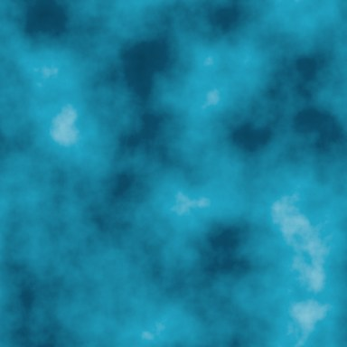

**Fractal noise (fbm / ridged / turbulence)** — Periodic Perlin/value fbm with optional domain warp, mapped through a colour ramp. Use output=height for height maps.

- tags: graphics, clouds, heightmap, mask, game, terrain
- scale: `frequency` (default tile holds 4×4 blobs)
- render: ~558 ms
- presets: `ridged-terrain`, `warped-sunset`, `clouds`

| param | type | default | range / options | notes |
|---|---|---|---|---|
| `basis` | enum | perlin | perlin \| value | Basis |
| `mode` | enum | fbm | fbm \| ridged \| turbulence | Mode |
| `frequency` | int | 4 | 1 – 64 | Base frequency (integer) |
| `octaves` | int | 6 | 1 – 10 | Octaves |
| `gain` | float | 0.5 | 0.1 – 0.9 | Gain (persistence) |
| `warp` | float | 0 | 0 – 1 | Domain warp |
| `contrast` | float | 1 | 0.2 – 4 | Contrast |
| `colors` | colors | #04202f, #0b4f6c, #20a4c3, #c9f1f5 | 1–16 colours | Colour ramp |
| `seed` | seed | 1 |  | Seed — Same seed + params = identical output, always. Change it for a different random variation. |

 

### marble

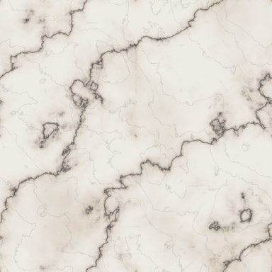

**Marble** — Turbulence-displaced veins (Perlin marble) at two scales: bold main veins with a soft halo and a sharp core, a web of fine hairline veins, and cloudy tonal drifts. Presets: Carrara, Calacatta gold, Nero Marquina, verde.

- tags: graphics, stone, luxury, interior, material, carrara, calacatta
- scale: `veins` (default tile holds 1×1 veins)
- render: ~2175 ms
- presets: `carrara`, `calacatta-gold`, `nero-marquina`, `verde-marble`

| param | type | default | range / options | notes |
|---|---|---|---|---|
| `base` | color | #eeebe5 |  | Base |
| `vein` | color | #5d5a57 |  | Vein |
| `tint` | color | #c9b8a0 |  | Cloud tint |
| `accent` ⁺ | color | #b08d57 |  | Vein halo / accent — Colour of the soft halo around main veins (gold for Calacatta). |
| `veins` | int | 1 | 1 – 16 | Main veins |
| `turbulence` | float | 1 | 0 – 6 | Turbulence |
| `sharpness` | float | 5 | 1 – 30 | Vein sharpness |
| `fine` | float | 0.5 | 0 – 1 | Fine veins |
| `seed` | seed | 12 |  | Seed — Same seed + params = identical output, always. Change it for a different random variation. |

 

### granite

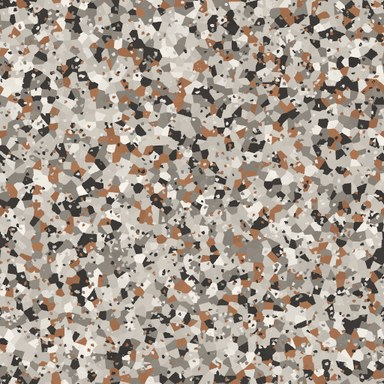

**Granite / speckled stone** — Interlocking mineral grains (Voronoi crystals) in a weighted palette — feldspar, quartz, mica — with polished glints and slight clouding.

- tags: stone, material, kitchen, interior, speckle, game
- scale: `grain` (default tile holds 48×48 grains)
- render: ~1849 ms
- presets: `black-galaxy-granite`

| param | type | default | range / options | notes |
|---|---|---|---|---|
| `grain` | int | 48 | 8 – 256 | Grains across |
| `colors` | colors | #c9c2b8, #8c857c, #3b3836, #e9e4dc, #a4704f | 1–16 colours | Minerals (first = most common) |
| `contrast` | float | 1 | 0.3 – 2 | Contrast |
| `glints` | float | 0.4 | 0 – 1 | Mica glints |
| `seed` | seed | 23 |  | Seed — Same seed + params = identical output, always. Change it for a different random variation. |

 

### wood

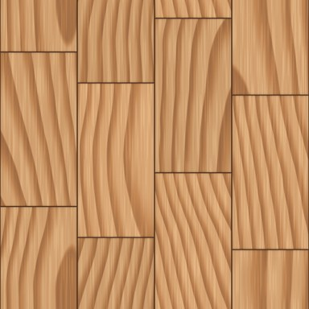

**Wood planks / floorboards** — Flat-sawn boards with cathedral growth-ring arches, wobbling grain, pore streaks, optional knots; per-board tone, bevelled seams and staggered butt joints like a real floor.

- tags: graphics, floor, material, game, interior, oak, timber
- scale: `planks` (default tile holds 4×4 planks)
- render: ~540 ms
- presets: `oak-floor`, `walnut`, `whitewashed-pine`

| param | type | default | range / options | notes |
|---|---|---|---|---|
| `planks` | int | 4 | 1 – 32 | Planks across |
| `plankLength` | int | 2 | 1 – 12 | Joints per tile height — Board ends per column; staggered between columns. |
| `rings` | float | 9 | 1 – 40 | Ring density |
| `wobble` | float | 0.8 | 0 – 3 | Grain wobble |
| `knots` | float | 0.2 | 0 – 1 | Knots |
| `colors` | colors | #e1b382, #c08552, #8c5a3c | 3–3 colours | Light, mid, dark |
| `seam` | float | 0.004 | 0 – 0.02 | Seam width (uv) |
| `variation` ⁺ | float | 0.5 | 0 – 1 | Board tone variation |
| `seed` | seed | 21 |  | Seed — Same seed + params = identical output, always. Change it for a different random variation. |

 

### parquet

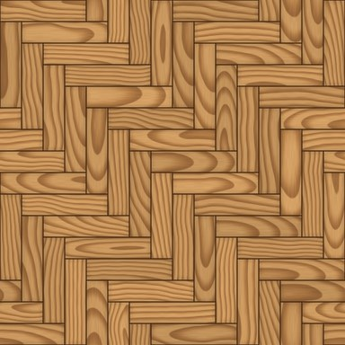

**Parquet (herringbone / chevron / basket)** — Wooden parquet floors: herringbone (planks k:1 at right angles), chevron (mitred V columns), basket (square blocks of parallel slats) or straight staggered planks. Every plank gets its own grain and tone.

- tags: floor, material, interior, wood, herringbone, chevron
- scale: `repeats` (default tile holds 2×2 repeats)
- render: ~512 ms
- presets: `parquet-chevron`, `parquet-basket`

| param | type | default | range / options | notes |
|---|---|---|---|---|
| `layout` | enum | herringbone | herringbone \| chevron \| basket \| straight | Layout |
| `repeats` | int | 2 | 1 – 16 | Repeats |
| `ratio` | int | 4 | 2 – 8 | Plank length : width |
| `rings` | float | 6 | 1 – 30 | Ring density |
| `wobble` | float | 0.7 | 0 – 3 | Grain wobble |
| `colors` | colors | #d9a86c, #b07a45, #7a4e2c | 3–3 colours | Light, mid, dark |
| `seam` | float | 0.06 | 0 – 0.3 | Seam (plank-width units) |
| `variation` | float | 0.6 | 0 – 1 | Plank tone variation |
| `seed` | seed | 27 |  | Seed — Same seed + params = identical output, always. Change it for a different random variation. |

 

### leopard

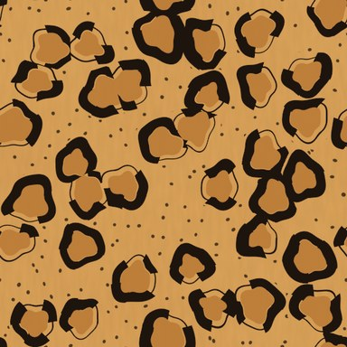

**Leopard / cheetah / jaguar** — Rosettes: broken irregular rings around each feature point with a darker, warmer centre (leopard), larger rosettes with inner dots (jaguar) or solid spots (cheetah). Fur ground with soft tonal drift.

- tags: clothes, print, animal, fashion
- scale: `cells` (default tile holds 6×6 rosettes)
- render: ~2527 ms
- presets: `cheetah`, `jaguar`, `snow-leopard`

| param | type | default | range / options | notes |
|---|---|---|---|---|
| `style` | enum | leopard | leopard \| jaguar \| cheetah | Style |
| `cells` | int | 6 | 2 – 48 | Rosettes across |
| `colors` | colors | #d9a35b, #b97834, #1d140e | 3–3 colours | Ground, centre, spot |
| `irregularity` | float | 0.6 | 0 – 1 | Irregularity |
| `seed` | seed | 13 |  | Seed — Same seed + params = identical output, always. Change it for a different random variation. |

 

### giraffe

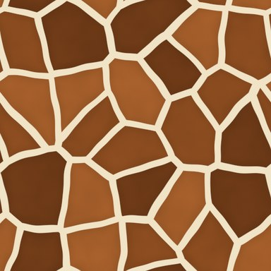

**Giraffe** — Warped Voronoi patches with mottled interiors separated by a cream network of even width (exact Voronoi edge distance).

- tags: clothes, print, animal
- scale: `cells` (default tile holds 5×5 patches)
- render: ~3284 ms

| param | type | default | range / options | notes |
|---|---|---|---|---|
| `cells` | int | 5 | 2 – 48 | Patches across |
| `border` | float | 0.12 | 0.02 – 0.5 | Border width |
| `colors` | colors | #f1e3c6, #8a4b1f, #6e3a17, #a35d2a | 2–8 colours | Network, patch colours… |
| `seed` | seed | 14 |  | Seed — Same seed + params = identical output, always. Change it for a different random variation. |

 

### zebra

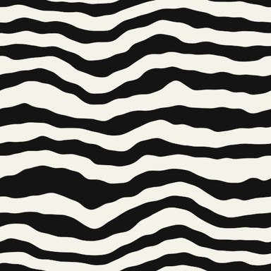

**Zebra / tiger stripes** — Noise-displaced, thickness-modulated stripes that fork and taper; tiger style adds broken stripe ends over an orange-to-cream fur ground.

- tags: clothes, print, animal
- scale: `stripes` (default tile holds 9×9 stripes)
- render: ~1103 ms
- presets: `tiger`

| param | type | default | range / options | notes |
|---|---|---|---|---|
| `style` | enum | zebra | zebra \| tiger | Style |
| `stripes` | int | 9 | 1 – 64 | Stripes |
| `warpAmount` | float | 0.6 | 0 – 2 | Warp |
| `colors` | colors | #f5f2ea, #141414 | 2–2 colours | Ground, stripe |
| `tigerColor` ⁺ | color | #e08a2e |  | Tiger fur colour |
| `seed` | seed | 15 |  | Seed — Same seed + params = identical output, always. Change it for a different random variation. |

 

### snakeskin

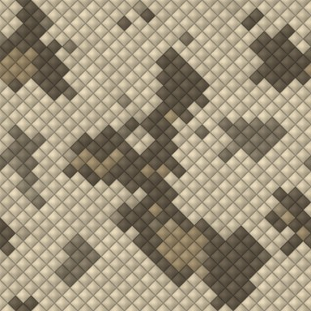

**Snakeskin (python / croc)** — Python: overlapping diamond scales, each domed and edged, under large blotch markings. Croc: rows of glossy domed rectangular scales of varying width with deep creases.

- tags: clothes, print, animal, leather, fashion, reptile
- scale: `cells` (default tile holds 20×20 scales)
- render: ~1438 ms
- presets: `python`, `croc-embossed`

| param | type | default | range / options | notes |
|---|---|---|---|---|
| `style` | enum | python | python \| croc | Style |
| `cells` | int | 20 | 4 – 96 | Scales across |
| `colors` | colors | #cfc3a8, #8d7c5e, #3a2f22 | 3–3 colours | Light, mid, markings |
| `markings` | float | 0.85 | 0 – 1 | Markings |
| `gloss` | float | 0.4 | 0 – 1 | Gloss |
| `seed` | seed | 29 |  | Seed — Same seed + params = identical output, always. Change it for a different random variation. |

 

### camouflage

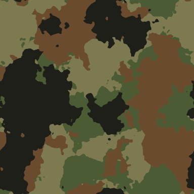

**Camouflage** — Woodland (layered thresholded fbm blobs with slightly ragged edges), digital (same field quantised to a pixel grid) or tiger-stripe camo (horizontal brush strokes).

- tags: clothes, military, streetwear, print
- scale: `scale` (default tile holds 3×3 blobs)
- render: ~1637 ms
- presets: `camo-digital`, `camo-desert`, `camo-tiger-stripe`, `camo-urban`

| param | type | default | range / options | notes |
|---|---|---|---|---|
| `style` | enum | woodland | woodland \| digital \| tiger-stripe | Style |
| `scale` | int | 3 | 1 – 16 | Blob frequency |
| `pixels` | int | 64 | 8 – 256 | Digital grid |
| `colors` | colors | #7d7a52, #4b5b33, #6b4b2e, #1f1f1a | 2–6 colours | Base + layers |
| `coverage` | float | 0.5 | 0.2 – 0.8 | Layer coverage |
| `seed` | seed | 16 |  | Seed — Same seed + params = identical output, always. Change it for a different random variation. |

 

### reaction-diffusion

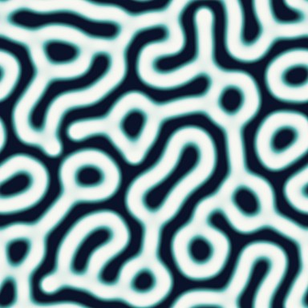

**Reaction–diffusion (Gray–Scott)** — Turing patterns from the Gray–Scott model on a periodic grid (seamless by construction), sampled with smooth bicubic filtering. Regimes: coral, mitosis, maze, spots, worms, holes. Cost ∝ grid² × iterations; results are cached.

- tags: graphics, generative, biological, coral, print
- scale: `grid` (default tile holds 20×20 features)
- render: ~2157 ms
- presets: `rd-mitosis`, `rd-maze`, `rd-worms`

| param | type | default | range / options | notes |
|---|---|---|---|---|
| `regime` | enum | coral | coral \| mitosis \| maze \| spots \| worms \| holes \| custom | Regime — Gray–Scott feed/kill pair; "custom" uses feed and kill below. |
| `feed` ⁺ | float | 0.0545 | 0.01 – 0.1 | Feed (custom) |
| `kill` ⁺ | float | 0.062 | 0.04 – 0.075 | Kill (custom) |
| `grid` | int | 160 | 48 – 512 | Simulation grid — Bigger = more, smaller features per tile (slower). |
| `iterations` ⁺ | int | 5000 | 200 – 30000 | Iterations |
| `colors` | colors | #0b132b, #5bc0be, #f7f7f2 | 1–16 colours | Colour ramp |
| `seed` | seed | 17 |  | Seed — Same seed + params = identical output, always. Change it for a different random variation. |

 

### voronoi-cells

**Voronoi cells (stained glass / cracked earth / cobblestone)** — Voronoi cells with EXACT border distance (even-width leading/grout/cracks). Stained glass with lead came and glass mottling, cracked earth with ragged cracks, domed cobblestones, or flat cells.

- tags: graphics, game, material, mosaic, stone
- scale: `cells` (default tile holds 8×8 cells)
- render: ~2507 ms
- presets: `cracked-earth`, `cobblestone`

| param | type | default | range / options | notes |
|---|---|---|---|---|
| `style` | enum | stained-glass | stained-glass \| cracked-earth \| cobblestone \| cells | Style |
| `cells` | int | 8 | 2 – 96 | Cells across |
| `jitter` | float | 1 | 0 – 1 | Jitter |
| `edge` | float | 0.08 | 0 – 0.5 | Edge width (cell units) |
| `colors` | colors | #ff5d8f, #ffd166, #06d6a0, #118ab2, #f8f9fa | 1–16 colours | Cell colours |
| `edgeColor` | color | #151515 |  | Edge colour |
| `seed` | seed | 18 |  | Seed — Same seed + params = identical output, always. Change it for a different random variation. |

 

### leather

**Leather grain** — Pebbled full-grain leather: irregular rounded pebbles at two scales separated by fine creases, wandering wrinkles, pores, tonal mottling and a soft sheen, lit from the real height field. Pair output=normal for 3D.

- tags: clothes, material, bag, shoes, upholstery
- scale: `cells` (default tile holds 40×40 pebbles)
- render: ~2619 ms
- presets: `black-leather`, `tan-leather`

| param | type | default | range / options | notes |
|---|---|---|---|---|
| `color` | color | #5a3522 |  | Colour |
| `cells` | int | 40 | 8 – 160 | Grain density |
| `crease` | float | 0.8 | 0 – 1 | Crease depth |
| `wrinkles` | float | 0.5 | 0 – 1 | Wrinkles |
| `sheen` | float | 0.3 | 0 – 1 | Sheen |
| `seed` | seed | 19 |  | Seed — Same seed + params = identical output, always. Change it for a different random variation. |

 

⁺ = advanced (a simple UI can hide it behind "More").

## Presets

| preset | pattern | name | params |
|---|---|---|---|
| `chambray` | `plain-weave` | Chambray | `{"warp":"#4f6d9a","weft":"#eef1f4","repeats":24,"heather":0.15}` |
| `linen` | `plain-weave` | Natural linen | `{"warp":"#cbbd9f","weft":"#d9ccb0","repeats":22,"slub":0.75,"heather":0.45,"irregularity":0.6,"yarnGap":0.16}` |
| `canvas` | `plain-weave` | Canvas / duck | `{"warp":"#c8b48a","weft":"#bba57a","repeats":14,"yarnGap":0.05,"twist":0.6}` |
| `oxford-cloth` | `basket-weave` | Oxford shirting | `{"warp":"#7da3d6","weft":"#f4f4f0","group":2,"repeats":14}` |
| `gabardine` | `twill` | Gabardine | `{"over":2,"under":2,"warp":"#5d5446","weft":"#6a604f","repeats":20}` |
| `chino` | `twill` | Chino drill | `{"over":2,"under":1,"warp":"#c2a878","weft":"#d6c6a2","repeats":16}` |
| `twill-3-1-s` | `twill` | 3/1 S-twill | `{"over":3,"under":1,"direction":"S","warp":"#5c3c2e","weft":"#e6d5b8"}` |
| `silk-satin` | `satin` | Silk satin | `{"shafts":8,"warp":"#c9a46b","weft":"#a8834c","sheen":0.85,"repeats":10}` |
| `satin-weft-face` | `satin` | Sateen (weft-faced) | `{"shafts":8,"face":"weft","warp":"#0f3b57","weft":"#c8d9e6"}` |
| `dogtooth-large` | `houndstooth` | Large dogtooth | `{"band":8,"repeats":2}` |
| `puppytooth` | `houndstooth` | Puppytooth (red) | `{"band":2,"repeats":8,"colors":["#7b1113","#efe6d8"]}` |
| `houndstooth-print` | `houndstooth` | Houndstooth (flat print) | `{"style":"flat","repeats":3}` |
| `herringbone-tweed` | `herringbone` | Herringbone tweed | `{"warp":"#3b3a36","weft":"#9b9078","heather":0.6,"slub":0.4,"irregularity":0.6,"repeats":4}` |
| `herringbone-draft` | `herringbone` | Herringbone (draft view) | `{"style":"draft","repeats":4}` |
| `sharkskin-navy` | `pick-and-pick` | Navy sharkskin | `{"colors":["#1d2840","#7c8aa6"]}` |
| `prince-of-wales-brown` | `glen-check` | Prince of Wales (brown) | `{"colors":["#4a3426","#e6dccb"],"overcheckColor":"#7d2a2a"}` |
| `gingham-navy` | `gingham` | Navy gingham | `{"colors":["#1f3a68","#ffffff"],"band":4,"repeats":6}` |
| `gingham-print` | `gingham` | Gingham (flat print) | `{"style":"flat","band":8,"repeats":4}` |
| `tartan-black-watch` | `tartan` | Black Watch | `{"sett":"black-watch"}` |
| `tartan-red-stewart` | `tartan` | Red Stewart-style | `{"sett":"red-stewart-style","countScale":0.6}` |
| `buffalo-check` | `tartan` | Buffalo check | `{"sett":"buffalo-check","countScale":1,"repeats":2}` |
| `flannel-plaid` | `tartan` | Brushed flannel plaid | `{"sett":"four-colour","countScale":1,"fuzz":0.55}` |
| `camel-check` | `tartan` | Camel check-style | `{"sett":"camel-check-style","countScale":1.2}` |
| `madras` | `tartan` | Madras | `{"sett":"madras-style","symmetric":false,"countScale":1,"yarnGap":0.1,"irregularity":0.5}` |
| `tartan-custom-hex` | `tartan` | Custom hex sett | `{"sett":"custom","threadcount":"#2d3047/24 #e0a458/4 #2d3047/8 #93b7be/16","countScale":1}` |
| `raw-denim` | `denim` | Raw selvedge denim | `{"indigo":"#16264a","wash":0,"irregularity":0.85,"slub":0.5}` |
| `stonewash-denim` | `denim` | Stonewashed denim | `{"indigo":"#3a5a8c","wash":0.85}` |
| `donegal-grey` | `tweed` | Donegal grey | `{"warp":"#6b6a66","weft":"#8d8a82","neps":0.55}` |
| `harris-herringbone` | `tweed` | Harris herringbone | `{"weave":"herringbone","warp":"#4b4a33","weft":"#7b6b4a","neps":0.3,"nepColors":["#a33b2a","#d8b26e","#3d6b6b"]}` |
| `waffle-weave` | `weave-draft` | Waffle / honeycomb | `{"draft":"11111111/10000001/10111101/10100101/10100101/10111101/10000001/11111111","warpColors":["#efe9df"],"warpCounts":"1","weftColors":["#e3dccf"],"weftCounts":"1","repeats":4,"yarnGap":0.18}` |
| `birdseye` | `weave-draft` | Bird's-eye | `{"draft":"0110/1001/1001/0110","warpColors":["#2b3440","#c9ced6"],"warpCounts":"1 1","weftColors":["#2b3440","#c9ced6"],"weftCounts":"1 1","repeats":10}` |
| `diamond-twill` | `weave-draft` | Diamond twill | `{"draft":"11000011/10000111/00001111/00011110/00111100/01111000/11110000/11100001","warpColors":["#5b2a3c"],"warpCounts":"1","weftColors":["#e4cfa8"],"weftCounts":"1","repeats":5}` |
| `rib-2x2-navy` | `knit` | 2×2 rib (navy) | `{"stitch":"rib-2x2","color":"#2f4858"}` |
| `seed-stitch` | `knit` | Seed stitch | `{"stitch":"seed","color":"#6c8e54"}` |
| `garter-stitch` | `knit` | Garter stitch | `{"stitch":"garter","color":"#c97b63"}` |
| `knit-basketweave` | `knit` | Knit basketweave | `{"stitch":"basketweave","color":"#c9a66b","stitchesAcross":24}` |
| `diamond-brocade` | `knit` | Diamond brocade | `{"stitch":"diamond-brocade","color":"#2f6f73","stitchesAcross":24}` |
| `fine-jersey` | `knit` | Fine jersey (t-shirt) | `{"stitch":"stockinette","color":"#3c3c44","stitchesAcross":48,"yarnRadius":0.27,"fuzz":0.2}` |
| `nordic-snowflake` | `fair-isle` | Nordic snowflake | `{"chart":"snowflake","colors":["#20304a","#f4f1e8"],"stitchesAcross":27}` |
| `christmas-trees` | `fair-isle` | Christmas trees | `{"chart":"trees","colors":["#a4161a","#f5f3f4","#5c4033"],"stitchesAcross":20}` |
| `fair-isle-hearts` | `fair-isle` | Hearts | `{"chart":"hearts","colors":["#f6e8ea","#c9184a"],"stitchesAcross":20}` |
| `aran-sweater` | `cable-knit` | Aran sweater | `{"cable":"mixed","stitchesAcross":40,"color":"#ece3cf"}` |
| `braid-cable` | `cable-knit` | Braided cable | `{"cable":"braid","stitchesAcross":30,"color":"#8c9a7e"}` |
| `chunky-cable-seed` | `cable-knit` | Chunky cable on seed | `{"ground":"seed","stitchesAcross":18,"color":"#d6c7b0","yarnRadius":0.3}` |
| `needlecord` | `corduroy` | Needlecord | `{"wales":28,"color":"#6b3b2a"}` |
| `wide-wale-cord` | `corduroy` | Wide-wale cord | `{"wales":7,"color":"#b38b4d","groove":0.15}` |
| `crushed-velvet-emerald` | `velvet` | Crushed velvet (emerald) | `{"color":"#0f5132","crush":0.85}` |
| `velvet-midnight` | `velvet` | Midnight velvet | `{"color":"#1b1f3b","crush":0.35,"sheen":0.8}` |
| `puffer-channel` | `quilted` | Puffer jacket | `{"layout":"channel","cells":6,"color":"#7a8b5c"}` |
| `quilted-satin-blush` | `quilted` | Quilted satin | `{"surface":"satin","color":"#e8b4b8","stitch":"#f4dfe0","cells":5}` |
| `fishnet` | `mesh` | Fishnet (see-through) | `{"backing":"transparent","cells":8}` |
| `tulle-white` | `mesh` | White tulle | `{"layout":"hex","cells":12,"yarn":0.06,"color":"#f5f5f5","backing":"#2b2d42"}` |
| `sequins-silver` | `sequins` | Silver sequins | `{"colors":["#b8bcc4"],"cells":14}` |
| `sequins-rainbow` | `sequins` | Rainbow sequins | `{"colors":["#e63946","#f4a261","#e9c46a","#2a9d8f","#457b9d","#9b5de5"],"cells":16}` |
| `cross-stitch-flower` | `cross-stitch` | Folk flower | `{"chart":"flower","repeats":3}` |
| `cross-stitch-strawberry` | `cross-stitch` | Strawberries | `{"chart":"strawberry","repeats":3,"colors":["#c1121f","#2d6a4f","#386641","#fefae0"]}` |
| `eyelet-see-through` | `eyelet-lace` | Eyelet (see-through) | `{"backing":"transparent"}` |
| `shibori-arashi` | `shibori` | Arashi | `{"style":"arashi"}` |
| `shibori-kumo` | `shibori` | Kumo | `{"style":"kumo"}` |
| `tie-dye-spiral` | `shibori` | Tie-dye spiral | `{"style":"spiral","cells":2,"colors":["#7b2cbf","#fff3b0"]}` |
| `breton` | `stripes` | Breton stripe | `{"colors":["#1b2a49","#f4f1ea"],"widths":"1 1.6","repeats":14}` |
| `pinstripe` | `stripes` | Pinstripe | `{"colors":["#e8e6e1","#22262e"],"widths":"1 16","direction":"vertical","repeats":12}` |
| `awning` | `stripes` | Awning stripe | `{"colors":["#d62828","#fdf0d5"],"widths":"1 1","direction":"vertical","repeats":6}` |
| `retro-diagonal` | `stripes` | Retro diagonal | `{"colors":["#f4a259","#5b8e7d","#f4e285","#bc4b51"],"widths":"3 2 1 2","direction":"diagonal","repeats":4}` |
| `wavy-candy` | `stripes` | Wavy candy stripe | `{"colors":["#ffcdb2","#e5989b","#6d6875"],"wave":0.35,"waveFreq":3,"repeats":6}` |
| `harlequin` | `checkerboard` | Harlequin | `{"diagonal":true,"colors":["#1d1d1d","#c1121f"],"cells":6}` |
| `racing-check` | `checkerboard` | Racing check | `{"cells":16}` |
| `ditsy-floral` | `dots` | Ditsy floral | `{"layout":"tossed","shape":"flower","rotate":true,"sizeJitter":0.5,"size":0.32,"cells":7,"colors":["#f28482","#f6bd60","#84a59d"],"background":"#f7ede2","centerColor":"#ffd166"}` |
| `tossed-stars` | `dots` | Tossed stars | `{"layout":"tossed","shape":"star","rotate":true,"sizeJitter":0.6,"size":0.3,"colors":["#ffb703","#fb8500","#219ebc"],"background":"#023047","cells":9}` |
| `hearts-brick` | `dots` | Hearts | `{"layout":"brick","shape":"heart","size":0.3,"colors":["#e5383b"],"background":"#ffe5ec"}` |
| `rain-drops` | `dots` | Raindrops | `{"layout":"half-drop","shape":"teardrop","colors":["#3d405b"],"size":0.26}` |
| `falling-leaves` | `dots` | Falling leaves | `{"layout":"tossed","shape":"leaf","rotate":true,"colors":["#2d6a4f","#40916c","#74c69d"],"background":"#fefae0","cells":8}` |
| `polka-transparent` | `dots` | Polka dots (transparent) | `{"background":"transparent","colors":["#111111"],"layout":"half-drop"}` |
| `missoni-zigzag` | `chevron` | Missoni zigzag | `{"colors":["#3d2c8d","#916bbf","#c996cc","#f9f871","#ff6f91"],"bands":15,"zigs":8,"amplitude":2}` |
| `argyle-golf` | `argyle` | Golf argyle | `{"colors":["#1b4332","#d8f3dc","#95d5b2"],"lineColor":"#081c15","dashed":true}` |
| `honeycomb-bevel` | `honeycomb` | Bevelled hex tiles | `{"style":"bevel","colors":["#3a86ff","#4895ef","#4361ee"],"background":"#0b0f2a"}` |
| `truchet-maze` | `truchet` | 10-PRINT maze | `{"variant":"maze","cells":16,"colors":["#111111","#f5f0e6","#111111"],"lineWidth":0.12}` |
| `truchet-triangles` | `truchet` | Triangle tiles | `{"variant":"triangles","cells":8,"lineWidth":0,"colors":["#f6bd60","#84a59d","#000000"]}` |
| `seigaiha-red` | `seigaiha` | Seigaiha (vermilion) | `{"colors":["#c1121f","#fdf0d5","#e76f51","#fdf0d5"],"outlineColor":"#780000"}` |
| `moroccan-ogee` | `ogee` | Moroccan ogee | `{"colors":["#f1faee","#a8dadc"],"lineColor":"#1d3557","dot":0.06}` |
| `islamic-six-star` | `islamic-star` | Six-point stars | `{"tiling":"6.6.6","angle":55,"repeats":2,"colors":["#1d3557","#e9c46a","#14213d"]}` |
| `islamic-square-60` | `islamic-star` | Square Hankin 60° | `{"tiling":"4.4.4.4","angle":60,"repeats":4,"colors":["#f2e9dc","#8c2f39","#461220"]}` |
| `terrazzo-pastel` | `terrazzo` | Pastel terrazzo | `{"background":"#f7f3ee","colors":["#f4acb7","#9d8189","#ffcad4","#d8e2dc","#ffe5d9"]}` |
| `halftone-lines` | `halftone` | Line screen | `{"dot":"line","field":"waves","colors":["#fdf0d5","#003049"]}` |
| `halftone-radial` | `halftone` | Radial halftone | `{"field":"radial","scale":2,"colors":["#ffffff","#111111"],"cells":32}` |
| `contour-hypsometric` | `contour-lines` | Hypsometric map | `{"fill":true,"colors":["#ffffff","#3d2b1f"]}` |
| `subway-tiles` | `bricks` | Subway tiles | `{"bond":"running","cols":6,"rows":14,"colors":["#f4f4f2","#ecebe7","#f8f8f6"],"mortarColor":"#9aa0a6","roughness":0.15,"chipping":0}` |
| `brick-basketweave` | `bricks` | Basket-weave pavers | `{"bond":"basket","cols":4,"rows":8}` |
| `flemish-bond` | `bricks` | Flemish bond | `{"bond":"flemish","cols":4,"rows":10}` |
| `graph-paper` | `grid-paper` | Graph paper | `{"style":"lines"}` |
| `dot-grid` | `grid-paper` | Dot grid | `{"style":"dots","cells":24,"majorEvery":0,"colors":["#fbfaf7","#8c8c8c","#8c8c8c"]}` |
| `blueprint` | `grid-paper` | Blueprint | `{"colors":["#1e4f8a","#4f7fb8","#d6e4f5"],"cells":20,"majorEvery":5}` |
| `isometric-grid` | `grid-paper` | Isometric grid | `{"style":"isometric","majorEvery":0}` |
| `ridged-terrain` | `noise` | Ridged terrain | `{"mode":"ridged","colors":["#1b4332","#52b788","#d8f3dc","#ffffff"],"frequency":3}` |
| `warped-sunset` | `noise` | Warped sunset | `{"warp":1,"colors":["#2d1e2f","#7b2d43","#e05e3c","#f7b267","#fef3e2"],"frequency":2}` |
| `clouds` | `noise` | Clouds | `{"colors":["#4a90d9","#ffffff"],"contrast":1.6,"frequency":3}` |
| `carrara` | `marble` | Carrara | `{"base":"#efeeea","vein":"#8a8d91","tint":"#dcdcdc","accent":"#b9bcc0","sharpness":4}` |
| `calacatta-gold` | `marble` | Calacatta gold | `{"base":"#f4f1ea","vein":"#4a4038","accent":"#c9a45c","veins":1,"turbulence":1.4,"sharpness":6,"fine":0.3}` |
| `nero-marquina` | `marble` | Nero Marquina | `{"base":"#151515","vein":"#efefef","tint":"#2a2a2a","accent":"#555555","veins":2,"turbulence":1.4}` |
| `verde-marble` | `marble` | Verde marble | `{"base":"#1f3d2b","vein":"#d8e8d0","tint":"#2f5a3f","accent":"#5f8f6a","veins":2,"turbulence":2}` |
| `black-galaxy-granite` | `granite` | Black granite | `{"colors":["#1c1c1e","#2c2c2e","#5a5a5e","#c9a45c"],"glints":0.7}` |
| `oak-floor` | `wood` | Oak floor | `{"colors":["#d8b58a","#b88b5e","#8a6240"],"planks":5,"rings":12}` |
| `walnut` | `wood` | Walnut | `{"colors":["#8b5e3c","#5d3a22","#3b2314"],"planks":4,"knots":0.35}` |
| `whitewashed-pine` | `wood` | Whitewashed pine | `{"colors":["#efe6d8","#d9c7ad","#b59c7d"],"planks":6,"knots":0.5}` |
| `parquet-chevron` | `parquet` | Chevron parquet | `{"layout":"chevron"}` |
| `parquet-basket` | `parquet` | Basket parquet | `{"layout":"basket","repeats":3}` |
| `cheetah` | `leopard` | Cheetah | `{"style":"cheetah"}` |
| `jaguar` | `leopard` | Jaguar | `{"style":"jaguar","cells":5}` |
| `snow-leopard` | `leopard` | Snow leopard | `{"colors":["#e9e6df","#cfc9bd","#3b3a38"]}` |
| `tiger` | `zebra` | Tiger | `{"style":"tiger"}` |
| `python` | `snakeskin` | Python | `{"cells":24,"colors":["#e8e2d0","#b9a77f","#2a241c"]}` |
| `croc-embossed` | `snakeskin` | Croc embossed | `{"style":"croc","colors":["#3f4a2f","#2b3320","#141a10"],"cells":12,"gloss":0.7}` |
| `camo-digital` | `camouflage` | Digital camo | `{"style":"digital","colors":["#c2b280","#8b7d5b","#5e5340","#3a3226"]}` |
| `camo-desert` | `camouflage` | Desert camo | `{"colors":["#d8c49a","#b89b6a","#8c6d46","#5a4630"]}` |
| `camo-tiger-stripe` | `camouflage` | Tiger-stripe camo | `{"style":"tiger-stripe","colors":["#9c9a6a","#4d5b33","#1e2016"]}` |
| `camo-urban` | `camouflage` | Urban camo | `{"colors":["#d9d9d9","#9e9e9e","#5e5e5e","#262626"]}` |
| `rd-mitosis` | `reaction-diffusion` | Mitosis | `{"regime":"mitosis","colors":["#fff8f0","#f08080","#6b2737"]}` |
| `rd-maze` | `reaction-diffusion` | Turing maze | `{"regime":"maze","colors":["#111111","#eeeeee"]}` |
| `rd-worms` | `reaction-diffusion` | Worms | `{"regime":"worms","colors":["#14213d","#fca311","#e5e5e5"]}` |
| `cracked-earth` | `voronoi-cells` | Cracked earth | `{"style":"cracked-earth","colors":["#b5835a","#a87449","#c4935f"],"edgeColor":"#3b2a1d","edge":0.06,"cells":7}` |
| `cobblestone` | `voronoi-cells` | Cobblestones | `{"style":"cobblestone","colors":["#8d8d8d","#7a7a7a","#a39e93"],"edgeColor":"#2b2b2b","cells":6,"edge":0.12}` |
| `black-leather` | `leather` | Black leather | `{"color":"#1d1c1c","sheen":0.5}` |
| `tan-leather` | `leather` | Tan saddle leather | `{"color":"#9a5b2e","cells":28,"crease":0.6}` |
