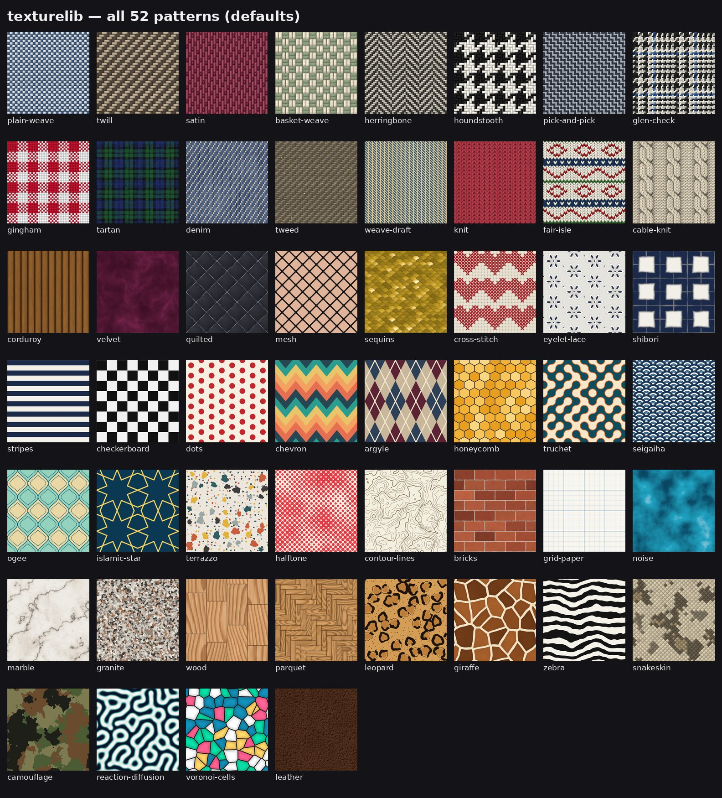

# texturelib (repo: patterngen)

**52 seamless, deterministic, procedural patterns for apps.** Realistic fabrics (weaves, tartan,
houndstooth, denim, tweed, knits, cables, Fair Isle, corduroy, velvet, quilting, sequins, lace,
shibori), print patterns (stripes, checks, florals, chevron, argyle, Truchet, Islamic stars, seigaiha,
halftone, grid paper…) and materials (marble, granite, wood, parquet, leather, animal prints,
snakeskin, camo, reaction–diffusion, Voronoi). It also ships **123 presets**, colour/height/normal
maps, transparent backgrounds and a worker renderer. Zero dependencies; runs in browsers, workers,
Electron and Node.



```js
import { render, createPattern } from './src/browser.js';          // or <script src="dist/texturelib.js"> → TextureLib.*

const tile = render('tartan', { width: 512, preset: 'madras' });  // seamless RGBA tile
ctx.fillStyle = createPattern(ctx, tile, { scale: 0.5, rotation: 15 });
ctx.fillRect(0, 0, canvas.width, canvas.height);                   // fill anything: shapes, text, a whole page
```

## Start here

| you want to… | read |
|---|---|
| **put it into TypeLab** | **[TYPELAB_INTEGRATION.md](TYPELAB_INTEGRATION.md)**: one install command, tested adapter |
| use it in any other JS app | [INTEGRATION.md](INTEGRATION.md): API, scale/tiling, colours, recipes (canvas, text, CSS, SVG, WebGL, workers, React, Node) |
| see every pattern / param / preset | [PATTERNS.md](PATTERNS.md) (generated) · `previews/sheets/*.jpg` · open `gallery.html` in a browser |
| change or add patterns | [CLAUDE.md](CLAUDE.md): architecture, pattern contract, commands, tests |
| know what changed since v1 | [CHANGELOG.md](CHANGELOG.md) · techniques and sources: [RESEARCH.md](RESEARCH.md) |

## Highlights

- **Seamless and exact:** every pattern is a function on a torus, and tests check
  `f(u, v) = f(u + 1, v)` exactly, not just visually.
- **Deterministic:** same params and seed give the same bytes on every machine (integer hashes, no `Math.random`).
- **Looks right at any size:** analytic antialiasing, rotated-grid supersampling, dithered output,
  and level-of-detail that fades sub-pixel detail instead of producing moiré.
- **Real fabric structure:** a weave-draft engine (any dobby draft and colour order, tartan from any
  threadcount), a knit-loop engine (interlocking stitches, purl bumps, ribs, cables), lit yarns with
  crimp, sheen, slubs and heather.
- **Never crashes on input:** params are coerced and clamped. 40 fuzzed param sets per pattern are rendered in the tests.
- **App-ready:** schema-driven UI metadata, presets, transparent backgrounds, material maps, worker
  pool with cancellation and caching, TypeScript types, CLI.

## Commands

```bash
npm test               # 471 checks: exact periodicity, seams, determinism, fuzzing, presets, alpha, LOD, API
npm run build          # dist/ bundles (esbuild via npx) + gallery.html
npm run catalog        # PATTERNS.md, patterns.json, src/patterns.d.ts from the code
npm run render && npm run sheets   # previews/ (needs Pillow for sheets)
node bin/texturelib.mjs render denim --size 1024 --out denim.png   # CLI
node integrations/typelab/install.mjs ../typelab                    # install into a TypeLab checkout
```

MIT licence.
