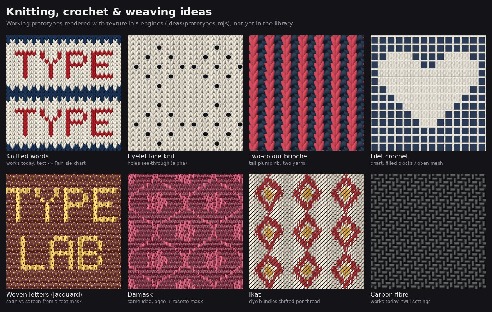

# TypeLab handoff: texturelib, every fix, and the next patterns

**Give this file to the Claude Code session working on TypeLab.** It is self-contained: what to
install, everything that was changed and why, and a catalogue of new pattern ideas with algorithms,
formulas and runnable prototype code. Read §0 and do §1 first. The other sections are reference.



## Contents

0. [Read me first](#0-read-me-first)
1. [Install texturelib into TypeLab](#1-install-texturelib-into-typelab-do-this-first)
2. [Every fix and improvement](#2-every-fix-and-improvement)
3. [How to add a pattern: two routes](#3-how-to-add-a-pattern-two-routes)
4. [Prototyped ideas (23): formulas and code](#4-prototyped-ideas-23-formulas-and-code)
5. [More ideas (not prototyped): algorithms](#5-more-ideas-not-prototyped-algorithms)
6. [Typography ideas for TypeLab](#6-typography-ideas-for-typelab)
7. [Recommended plan](#7-recommended-plan)
8. [Caveats](#8-caveats)

---

## 0. Read me first

**What exists.** The repo `helium0o/patterngen`, branch **`claude/keen-ritchie-qy7bl3`**, contains:

- **texturelib v2**: 52 seamless procedural patterns (fabrics, prints, materials) and 123 presets.
- **A tested TypeLab adapter** that adds them to TypeLab's Pattern workspace as `tx-*` generators.
- **This handoff**, plus `ideas/`: 23 prototypes of new patterns with their code.

`main` only has the initial commit until that branch is merged. After a merge, use `main`.

**Get the repo next to TypeLab:**

```bash
git clone -b claude/keen-ritchie-qy7bl3 https://github.com/Helium0o/patterngen ../patterngen
```

In a Claude Code cloud session, attach it with `add_repo` (owner `helium0o`, repo `patterngen`), then
check out that branch.

**Your three jobs, in order:**

1. **Install** the library into TypeLab (§1). Scripted and verified, about 5 minutes.
2. **Know what changed** (§2), so you can answer the user and avoid re-breaking things.
3. **Build new patterns** from the catalogue (§4–§6), the way §3 describes, in the order §7 suggests.

**File map**

| path (in patterngen) | what |
|---|---|
| `TYPELAB_INTEGRATION.md` | full install and adapter reference (config, rendering path, troubleshooting) |
| `integrations/typelab/` | `install.mjs`, `verify-in-typelab.mjs`, the adapter `texturelib-typelab.js`, `typelab-ui.patch`, screenshot |
| `dist/texturelib.js`, `dist/texturelib.worker.js` | the built library (classic script, global `TextureLib`). Committed, so no build is needed. |
| `CLAUDE.md` | how the library is built, the **pattern contract**, commands, gotchas |
| `PATTERNS.md` | every pattern, param, range and preset (generated) |
| `CHANGELOG.md`, `RESEARCH.md` | what changed in v2, and the techniques behind it, with sources |
| `ideas/prototypes.mjs` | 23 runnable prototypes (§4); `--check` tests seamless tiling |
| `ideas/knit-eyelet.patch` | knit-engine change for lace eyelets (`git apply`-able, suite stays green) |
| `ideas/knit-lace-proto.js` | knit engine with that patch applied, plus prototype lace and brioche patterns |
| `ideas/examples/hitomezashi.js` | **a prototype turned into a finished library pattern**: the template for new ones |
| `ideas/typelab/text-to-fabric.js` | TypeLab-side helpers, tested in TypeLab: knit or weave the user's text with today's generators (§6) |
| `ideas/typelab/vector-hitomezashi.js` | a native TypeLab vector generator (Route B), tested in TypeLab |
| `ideas/renders/*.jpg`, `ideas/sheets/*.jpg` | one render per prototype, plus 3 titled contact sheets |

---

## 1. Install texturelib into TypeLab (do this first)

From the TypeLab repo root:

```bash
node ../patterngen/integrations/typelab/install.mjs .        # copies 3 files + 5 small edits; safe to rerun
NODE_PATH=$(npm root -g) node ../patterngen/integrations/typelab/verify-in-typelab.mjs app/index.html   # 13 checks
npm start                                                     # Pattern workspace → "Fabrics · woven" etc.
npm run dist                                                  # rebuild the .exe
```

- The verifier needs Playwright and Chromium, installed **globally** so TypeLab's `package.json` stays
  untouched: `npm i -g playwright && npx playwright install chromium`.
- No Electron or display (a cloud session)? The verifier is the substitute: it loads the real
  `app/index.html` from `file://` in Chromium. Ask the user to click through *Pattern → New pattern →
  Fabrics · woven* and to run `npm run dist` on their machine. **The `.exe` itself was never tested here.**
- **What install.mjs changes in TypeLab:**

  | file | change |
  |---|---|
  | `app/js/vendor/texturelib.js` | new: the library |
  | `app/js/vendor/texturelib.worker.js` | new: classic worker, same style as `js/dither-worker.js` |
  | `app/js/texturelib-typelab.js` | new: the adapter |
  | `app/index.html` | 2 `<script>` tags right after `js/patterns.js` |
  | `app/js/ui/mode-pattern.js` | 3 optional one-liners: presets also apply colours; colour slots get name tooltips; PNG tile export renders on workers |

  If an anchor isn't found, that edit is skipped, not half-applied, and the script exits 1 with the
  manual step. The exact edits are in `integrations/typelab/typelab-ui.patch`, made against TypeLab `d4c0832`.
- **Commit in TypeLab:** the 3 new files, `app/index.html` and `app/js/ui/mode-pattern.js`, as ROADMAP
  milestone **M19** with version 2.1.1 → 2.2.0. The suggested ROADMAP text is in `TYPELAB_INTEGRATION.md`.
- **Never rename the `tx-` prefix or a pattern id.** TypeLab's loader (`state.js`) drops pattern layers
  whose generator id is unknown, so saved documents would lose those layers.

What the user gets:

- 52 raster generators in 5 new gallery groups, and 123 presets in the Preset picker.
- Texture-filled text via *Use as fill of → Text*.
- Workers render tiles in the background, with a quick provisional preview first, using the same
  `TL.fx.provisional` mechanism as the Embroidery filter.
- Real alpha when *Fill background* is off.
- Exports: exact PNG, and SVG with the tile embedded.

---

## 2. Every fix and improvement

v1 is the zip the user uploaded (generated by an earlier session). v2 is the current branch. Seeded
outputs differ from v1, so v1 renders can't be reproduced. Details: `CHANGELOG.md`; sources: `RESEARCH.md`.

### 2.1 Engine (affects every pattern)

| v1 problem | v2 fix | where |
|---|---|---|
| No transparency; `out[3]` was height | Premultiplied linear RGBA end to end. `out = [r, g, b, a, height]`. Colour params accept `#rgb(a)`, `#rrggbb(aa)`, `rgb()/rgba()`, `hsl()/hsla()`, `transparent`. Lace holes, fishnet and motif-only prints are see-through. | `core/color.js`, `core/raster.js` |
| Moiré and flicker on small or dense tiles | Level of detail: `ctx.pixel` + `detail(period, pixel) = 1 − smoothstep(0.25, 0.6, pixel/period)` fades sub-pixel detail. Whole threads, stitches and wales blend to their average colour when a cell gets near 1 px. A test renders dense fabrics tiny. | `core/math.js`, every pattern |
| Aliased near-axis edges; banding in gradients | Rotated-grid supersampling (RGSS, 4 samples). Premultiplied accumulation, then un-premultiply and sRGB-encode with a deterministic ±½ LSB dither. | `core/raster.js` |
| Normal-map strength depended on output size | Sobel normals with resolution-independent strength (`strength · tileW/512 · 0.25`); OpenGL or DirectX format | `core/raster.js` |
| Non-square outputs stretched the tile | Non-square outputs hold whole square tiles (`autoTiles`, `tiles: [x, y]`) | `core/raster.js` |
| Noise allocated an options object per sample | `noiseField()` / `warpField()` are built once in `prepare`. Cheaper lowbias32 lattice hash; PCG3D is kept for general hashing. | `core/noise.js` |
| Voronoi borders swelled at corners (F2−F1) | `voronoiEdge()` returns the exact distance to the nearest bisector (Quilez), so giraffe, stained glass and cracks have even widths | `core/noise.js` |
| No UI metadata | `step` and `advanced` per param (TypeLab puts advanced params in its *Advanced* fold). Colour lists accept comma strings; seeds accept strings. | `core/params.js` |
| No way to embed in a classic-script app | `dist/texturelib.js` (IIFE, global `TextureLib`, works with `importScripts`), `.min.js`, `.mjs`, `texturelib.worker.js`. `createRenderer()` worker pool with row bands, LRU cache and slot/AbortSignal cancellation. | `dist/`, `src/renderer.js` |
| Small API | `renderMaps` (colour + height + normal in one pass), `renderArea`, `renderRegion`, `featureCount`, `tileSizeFor`, `listPresets` / `getPreset` / `render({ preset })`, `createSampler(...).into()`. Browser helpers: `toCanvas`, `createPattern(ctx, img, {scale, rotation, offsetX, offsetY})`, `toBlob`, `cssBackground`. TypeScript types, including generated per-pattern params. | `src/index.js`, `src/browser.js`, `*.d.ts` |
| Params named `preset` clashed with the `render({ preset })` option | tartan `preset` → `sett`, reaction-diffusion `preset` → `regime`. `render()` reports the preset it actually applied. | `woven.js`, `organic.js`, `index.js` |

### 2.2 Patterns (45 → 52, plus 123 presets)

- **Woven (13), one shared engine.** v1 looked like flat squares, and the first v2 pass looked like
  plastic. Final engine:
  - Each top yarn is a lit cylinder whose float rises and dives (float runs precomputed from the draft),
    with relief 0.36 and wrap lighting `(n·l + 0.35)/(l_z + 0.35)`.
  - Specular `pow(n·h, 9) · sheen · 0.75`. Optional twisted-fibre striations, slubs, heather, brushed
    fuzz and neps. Analytic edge antialiasing.
  - Herringbone uses a proper *broken* reversal. Denim has 1.4× more ends than picks (a steep twill
    line), ring-spun dye and slubs.
  - Satin has a real lustre. Tartan gets 4 more setts.
  - New: **tweed** (coloured neps).
- **Knit (3), rewritten.** v1 had dark triangles between the Vs.
  - Each knit stitch is two curved ellipse "leg" elements from `(0.04, 0)` to `(0.5, 1.42·H)`, so every
    V nests into the row below. Purl stitches are a head (∩) and a sinker (∪) bump.
  - A 4×3 stitch neighbourhood is evaluated and the highest element wins, so loops interlock across
    cells. Draw order doesn't matter.
  - Depth rules: purl columns recede in ribs; purl rows stand out in garter and welting.
  - New stitches: rib 3×1, welting, diamond brocade. New charts: hearts, trees, stripes.
  - Cables: rope, **braid** and mixed (aran). S-curves with straight runs, front/back depth, cast
    shadows, and a reverse-stockinette or seed ground.
- **Textile (8):**
  - Corduroy: pile streaks, sheen, and an LOD fade for the wales.
  - Quilting: lit from its height field, with nylon, satin and cotton surfaces.
  - Fishnet: knots, twist, shadow, transparent backing.
  - Sequins: tilted, cupped metal discs in mixed colours.
  - Cross-stitch: two-strand floss.
  - Shibori: fibre-wicking edges, plus a tie-dye spiral.
  - New: **velvet**, **eyelet lace**.
- **Geometric (15):**
  - Wavy stripes; harlequin checks.
  - Dots: flower, triangle, hexagon, teardrop, moon and leaf motifs; outline; centre dots.
  - Rounded chevrons; dashed argyle; bevelled hex; 6-fold Islamic stars; terrazzo grit.
  - Halftone: line, square and diamond screens, a radial field, and merging dots that are no longer clipped.
  - Bricks: Flemish and basket bonds, pits, chipping.
  - New: **grid paper** (graph, dot, isometric).
- **Organic (13):**
  - Marble: halo, core and hairline veins.
  - Wood: planks with cathedral grain, staggered joints and knots.
  - Leather: lit pebble grain, creases and pores.
  - Jaguar style; giraffe with exact even borders; zebra forks.
  - Camouflage: tiger-stripe. Reaction–diffusion: bicubic (Catmull-Rom) sampling. Voronoi: stained-glass lead came.
  - New: **granite**, **parquet** (herringbone, chevron, basket, straight), **snakeskin** (python with
    scale-aligned markings, croc).

### 2.3 Bugs found by the tightened tests, and the rule each one teaches

The suite checks `sample(u, v) == sample(u + k, v + m)` **exactly**, with u and v outside [0, 1).
That caught these bugs; some came from v1, others were introduced and caught during the rework.

| bug | root cause | rule |
|---|---|---|
| Woven slub noise not periodic | noise sampled at unwrapped thread coordinates | noise frequency must be an integer and equal to its period (`slubFx`, `slubFy`) |
| Knit tone not periodic | `seedY` from the unwrapped row, plus an `X*0.5` term | key per-row/column randomness on `mod(row, R)`; no fractional multiples of cell coordinates |
| Shibori gate not periodic | `u*0.5` term | only integer combinations `a·u + b·v` |
| Corduroy pile not periodic | non-integer noise frequency | round the frequency to an integer **and** use it as the period |
| Velvet, python scale ids | hashed unwrapped ids | wrap before hashing; python uses the invariant id `(mod(ai, n), mod(bi − ai, 2n))` |
| Halftone merged dots clipped at cell edges | each pixel only looked at its own cell | evaluate up to 3 neighbouring cells, gated near borders |
| Running-bond brick hash, basket bond | wrong modulus (`2n` instead of `n`); mixed units | hash with the period actually used; work in row units |
| Isometric grid line width wrong | gradient magnitude ignored the row scale | AA width from `hypot(n, rows/2)` |
| Wavy stripes | non-integer direction vector | `along = db·u − da·v` with integers |
| Parquet chevron gaps | wrong lattice | `wc = k/√2`, `Hp = cols·wc`, `perCol = cols·k/2` |
| Mesh shadow wrong | `netAlong` overwritten by the shadow call | save shared scratch values before calling helpers |
| First `sdPolygon`, teardrop SDF | wrong formulas | IQ regular-polygon SDF; uneven-capsule SDF |
| `voronoiEdge` test failed | inequality written backwards | `(F2 − F1)/2 ≤ edge ≤ F2` |
| Prototypes (found while writing this handoff) | tread plate N = 7 and perforated metal N = 9 with checker/stagger alternation; hitomezashi indexed arrays with negative cells; tread-plate highlight overflowed to ×36 | even counts for alternation; `mod()` before indexing; keep colour factors bounded |

### 2.4 Performance (measured, 512² tile, supersample 2, one core)

- Faster than v1: noise 2×, contours 1.9×, camouflage 1.6×, marble 1.25×. Sources: the lowbias32
  lattice hash, Worley `cellHash`, noise fields built once, a 3×3 first pass in `voronoiEdge`, and
  neighbour gating in halftone.
- Leather: 7.2 s → 1.5 s, with analytic pebble lighting instead of numeric normals.
- Slower than v1 because they gained real geometry: knit ≈ 0.9 s, leather ≈ 1.5 s, voronoi ≈ 1.1 s.
  Most patterns take 0.1–0.9 s; the heaviest take 1–3 s. Workers and LOD keep TypeLab interactive.
- Previews switched to JPEG: 41 MB → 11 MB in the repo.

### 2.5 Integration fixes

| problem | fix |
|---|---|
| **Renderer hang:** a slot-cancelled request with queued bands never settled, so a TypeLab tile could stay blurry forever | queued bands of a cancelled request are rejected with an `AbortError` in `pump()`; try/catch around `Promise.all`; regression tests with a fake Worker |
| Verifier claimed 12 checks but ran 11; no real clip check | added a real text-fill clip check |
| Verifier hard-coded pattern ids | picks from what's installed and respects `TEXTURELIB_TYPELAB` include/exclude |
| Verifier wrote `typelab-verify/` into the TypeLab root | writes to `<os temp>/typelab-verify/` |
| Wrong verify path in install.mjs output | prints an absolute command |
| Config undocumented | config table in `TYPELAB_INTEGRATION.md` (workers, workerUrl, include, exclude, categories) |
| Docs cloned the default branch, which is empty | clone with `-b claude/keen-ritchie-qy7bl3` (fixed in this handoff) |
| **Preset colours misaligned in TypeLab** (found while writing this handoff): when a preset's colour list had a different length from the default, every colour slot after it shifted. 11 of 123 presets rendered with wrong colours (e.g. *Clouds* picked up 2 extra default colours; *Waffle weave* and *Diamond twill* got the wrong weft colour). A preset colour without a slot (*Ditsy floral*'s centre dots) was dropped. | adapter: fixed-size colour lists are cycled or truncated to their slot count; the variable list grows **and shrinks**; slot-less preset colours ride in `L.p`. New verifier check 13 renders all 123 presets through TypeLab's preset logic and compares pixels with the library: 123/123 match (11 failed before the fix). |

A fresh Claude subagent with no context followed `TYPELAB_INTEGRATION.md` on a clean TypeLab copy. It
worked first time; all of its feedback is addressed above.

---

## 3. How to add a pattern: two routes

### Route A (recommended): a texturelib pattern, which appears in TypeLab automatically

Add the pattern object to `src/patterns/<category>.js` in patterngen. Then `npm run build`, rerun
`install.mjs`, and TypeLab shows it as `tx-<id>`. The adapter maps the schema to TypeLab controls
(int/float → slider, enum → select, bool, color → colour slots, string → text, seed → dice slider),
and presets to the Preset picker. You don't touch TypeLab code.

Use Route A for anything **shaded or textured**: knits, crochet, weaves, embroidery with thread
lighting, materials, marbling, fur. It also gives height and normal maps for free.

**The contract** (full version in `CLAUDE.md`):

```js
{
  id: 'kebab-id', name: 'Name', category: 'woven'|'knit'|'textile'|'geometric'|'organic',
  tags: [...], description: '1–2 sentences',
  scale: 'cells',                                  // the param that sets density (features per tile)
  features: (p, state) => [nx, ny, 'unit'],        // optional exact feature count
  params: { cells: P.int(20, 2, 128, 'Label', 'help'), thread: adv(P.float(...)), background: P.color(...), seed: P.seed(1) },
  prepare(p, { width, height, tiles }) { return state },   // precompute EVERYTHING here
  sample(u, v, out, ctx, state) { ... }            // hot path: ~1M calls per 512² tile
}
// out = Float64Array(5), pre-filled [0, 0, 0, 1, 0.5]: linear premultiplied rgb, alpha, height
// colours: hexToLinear('#hex') → 4-vector; shade(out, c, k), mix(out, a, b, t), over(), ramp()
// ctx = { px (sub-pixel size in uv, for AA), pixel (output pixel in uv, for LOD), width, height, ss, tileW, tileH }
```

**Seamless-tiling cookbook.** Every rule below comes from a bug in §2.3.

1. Repeat counts are integers. Use **even** counts wherever something alternates (checker, half-drop,
   stagger): `evenInt(n)`, `multipleOf(n, k)`.
2. Wrap every cell index before hashing or indexing an array: `hash01(mod(i, n), mod(j, n), seed)`,
   `table[mod(i, n)]`.
3. Noise only from `core/noise.js`, with an integer frequency that is also the period. Build it once in
   `prepare` with `noiseField()` / `warpField()`.
4. Rotations only through integer lattice vectors, e.g. 45° = `(u + v)·N` and `(u − v)·N`.
5. Hex and triangle lattices: fit an even number of rows to the square (`K = evenInt(2N/√3)`); shapes
   are within a few % of regular.
6. Global constraints must close on the torus. Example: a hitomezashi 2-colouring needs an even
   number of 0-bits per axis, so flip one bit in `prepare`.
7. Antialias analytically: compute a signed distance in **uv** (cell distance ÷ repeat count) and use
   `coverage(d, ctx.px)`. Fade fine detail with `detail(period, ctx.pixel)`, and fade whole repeated
   structures to their average colour.
8. No allocation in `sample`: use module-level scratch arrays and precomputed tables. Light from the
   top-left (`lambert(nx, ny)`).
9. Check it: `npm test -- --only <id>` (periodicity, seams, determinism, 40 fuzzed param sets, NaN,
   alpha range). While prototyping: `node ideas/prototypes.mjs --check`.

**Worked example: `ideas/examples/hitomezashi.js`.** The hitomezashi prototype turned into a finished
pattern. It shows:

- params with help text, an `adv()` param, and a `background` colour, so TypeLab's *Fill background:
  off* makes it transparent;
- a `text` param ("spell the rows: vowel = 1"), so TypeLab users can type a word;
- the torus parity fix in `prepare`; analytic AA; fabric texture faded by `detail()`; whole-structure
  LOD to a precomputed average colour.

With it registered, `npm test` passed 486/486, and renders were checked at full size, zoomed, and at
64 px with 128 cells (flat average, no moiré). To ship it:

1. Paste the object into `src/patterns/geometric.js` and add it to the default export.
2. Add 1–4 presets in `src/presets.js`.
3. Run `npm test && npm run catalog && npm run build && npm run render && npm run sheets`, then rerun
   `install.mjs`.
4. Update the pattern counts in README / CLAUDE.md / TYPELAB_INTEGRATION.md: 52 → 53.

**Engine hooks you can reuse:**

- **Weave engine** (`src/patterns/woven.js`): `weaveState(draft, warpCols, weftCols, opts, { warpColor?, weftColor? })`
  and `weaveSample(u, v, out, ctx, state)`.
  - `draft = { w, h, up(pick, end) → bool }`, so a draft can be any function. That is how jacquard,
    damask and woven letters work.
  - `drafts.plain/twill/satin/basket/herringbone/waffle/parse` build standard drafts.
  - `warpColor(end, pick)` makes per-crossing colour possible (ikat).
- **Knit engine** (`src/patterns/knit.js`): `knitState(p, stitch, chart, colors)`.
  - `stitch = { w, h, fn(r, c) → 'k'|'p' }`; `'o'` (eyelet) is added by `ideas/knit-eyelet.patch`.
  - `parseChart('0110/1001')`, `STITCHES[...]`, `knitSample`.
- **Noise:** `noiseField`, `warpField`, `worley` (F1, F2, id, cell centre), `voronoiEdge`, `valueNoise(x, y, px, py, seed)`.
- **SDFs** (`core/math.js`): `sdSegment`, `sdBox`, `sdPolygon`, `sdStar5`, `sdHeart`, `smin`.

### Route B: a native TypeLab vector generator

TypeLab's own generators (`app/js/patterns.js`) build **vector items** that become a canvas tile *and*
real SVG. Use this route for crisp line art where vector SVG export matters: sashiko, hitomezashi,
kumiko, Greek key, sayagata, guilloché, wallpaper groups, Celtic knots, quatrefoil, tumbling blocks.
You can also do both: a shaded `tx-` version and a flat vector version.

```js
// in app/js/patterns.js, next to gen('checker', …). Builder: b.T = tile size (doc px), b.r() = seeded rng (L.p.seed),
// b.rand(a, b), b.poly(c, pts, smooth?), b.rect(c, x, y, w, h), b.circle(c, x, y, r), b.line(c, pts, width, closed?)
// c = colour index into L.colors (0 = background). Items are wrapped across the seam automatically, but counts
// that alternate must still close at the seam (same torus rules as Route A).
gen('hitomezashi', 'Hitomezashi Sashiko', 'Geometric', ['#1f2f56', '#f3efe6'],
  [R('cells', 'Stitches across', 4, 60, 20), R('density', 'Offset density', 0, 1, 0.5, 0.01),
   R('stitch', 'Stitch length', 0.3, 1, 0.76, 0.01), R('width', 'Thread width', 0.03, 0.3, 0.14, 0.01), ...camoCommon],
  (b, p) => {
    const n = p.cells + (p.cells % 2), s = b.T / n, lo = (1 - p.stitch) / 2;
    const bits = () => Array.from({ length: n }, () => (b.r() < p.density ? 1 : 0));
    const rb = bits(), cb = bits();
    for (let j = 0; j < n; j++) for (let i = 0; i < n; i++) {
      if ((i + rb[j]) % 2 === 0) b.line(1, [[(i + lo) * s, j * s], [(i + 1 - lo) * s, j * s]], s * p.width);
      if ((j + cb[i]) % 2 === 0) b.line(1, [[i * s, (j + lo) * s], [i * s, (j + 1 - lo) * s]], s * p.width);
    }
  });
```

Route B notes:

- **Tested** in headless Chromium inside TypeLab `d4c0832`: 462 vector items, canvas and SVG tiles, no
  page errors (`ideas/renders/typelab-vector-hitomezashi.jpg`). Copy: `ideas/typelab/vector-hitomezashi.js`.
- **Gallery groups:** Route B generators go in TypeLab's existing groups (`cat`), or a new one such as `'Sashiko'`.
- **Saved documents:** they store the id, so treat new ids as permanent.

---

## 4. Prototyped ideas (23): formulas and code

All 23 live in `ideas/prototypes.mjs` (one `proto(name, …)` block each).

```bash
node ideas/prototypes.mjs                  # render all → ideas/out/*.png
node ideas/prototypes.mjs damask ikat      # render some
node ideas/prototypes.mjs --check          # exact seamless test → all 21 sample-based prototypes pass
python3 ideas/make-sheets.py               # → ideas/renders/*.jpg + ideas/sheets/*.jpg
```

Renders are in `ideas/renders/<name>.jpg`. **What every prototype still needs before it is a library
pattern:**

- params with ranges and help text, colour params, a `seed`;
- LOD (`detail()` plus an average-colour fade);
- 1–4 presets;
- the library tests.

The *Status* column says what else each one needs. *Route* is A (texturelib) or B (TypeLab vector), per §3.

### 4.1 Knitting and crochet

| idea | how it works | status | route |
|---|---|---|---|
| **Knitted words** `knitted-word` | text → 0/1/2 chart rows `'2222…/0202…/0110…'`, then `render('fair-isle', { params: { chart: 'custom', customChart, stitchesAcross: cols } })` | **works today** in TypeLab (`tx-fair-isle`). See §6 for a canvas text-to-chart helper. | A (exists) |
| **Eyelet lace** `lace-knit` | stitch kind `'o'` = yarn-over: no loop elements for that cell. A hole of radius 0.4 stitch, centred at `(c + 0.5, r + 0.55)` with distance scaled by `H·1.1`, is **alpha 0** with an antialiased edge. Around it, a ring (0.4 → 0.62) of stretched yarn: brightness `(0.45 + 0.6·sin(πq))·(0.9 + 0.12·cos(θ + 2.3))·(0.92 + 0.08·sin 9θ)` with `q = (d − 0.4)/0.22`. Prototype chart: 10×12 diamond `abs(c − 5) + abs(r − 6) == 4` on even rows, plus a centre hole. | engine change ready: `ideas/knit-eyelet.patch` (suite stays green). Next: decreases leaning into the holes (§5.1), a hole LOD fade, lace chart presets (Feather & Fan, leaf, chevron). | A |
| **Brioche** `brioche` | prototype = fake brioche: 1×1 rib, thick yarn (`yarnRadius` 0.33), short rows (`gauge` 0.95), chart `'01'` colouring alternate columns | looks right at a glance. Real brioche drapes a tuck strand of the other colour over each knit column (§5.1). | A |
| **Filet crochet** `filet-crochet` | 14×14 chart. Each row has a chain band at `abs(fy − 0.1) < 0.095` with profile `sqrt(1 − (d/0.095)²)`. Posts (round cords, profile `sqrt(1 − (dx/w)²)`) sit at x ∈ {0, ⅓, ⅔, 1} with w = 0.175 in filled blocks, and x ∈ {0, 1} with w = 0.11 in open mesh. Twist shading: posts `0.85 + 0.15·sin(2π·3·along)`, band `0.82 + 0.18·abs(sin(2π·along))`. Holes are **alpha 0**. | needs a chart param (same `'0110/…'` format) and a real crochet loop model (§5.1) | A |

### 4.2 Weaving

| idea | how it works | status | route |
|---|---|---|---|
| **Woven letters (jacquard)** `woven-letters` | mask-driven draft: `up(p, e) = mask[p/k][e/k] ? satin8warp.up(p, e) : satin8weft.up(p, e)`. Inside the glyph the gold warp floats; outside, the wine weft. Thread count must be a multiple of the satin size (8) and of k (4 threads per mask pixel). | works with the existing engine. Needs a `mask` string param ('0101/…') fed by TypeLab text (§6), plus a structure choice (satin 5/8, twill). | A |
| **Damask** `damask` | same, with an ornamental mask: an ogee band `abs(abs(fx − ½) − ½·sin²(π·fy)) < 0.035` (2×2 per tile), plus 5-petal rosettes `r < 0.2·(0.55 + 0.45·abs(cos 2.5θ))` with a centre dot, on satin 5, N = 90 threads. Single colour family; the figure shows through sheen (0.8). | as above, plus a motif enum (ogee rosette, fleur, scroll) | A |
| **Ikat** `ikat` | `weaveState(..., { warpColor(end, pick) })`. Each warp end gets a dye shift `off = floor(hash01(e)·7) − 3` picks. Motif: diamond `d = abs(x) + 0.8·abs(y)` on a 40-thread repeat; `d < 6` → mustard, `9 < d < 16` → red, else cream. Twill 3/1, navy weft. | needs params for motif, shift and bleed. Add per-pick noise to the colour boundary for dye wicking. | A |
| **Carbon fibre** `carbon-fibre` | twill 2/2, near-black warp and weft, `sheen: 1, yarnGap: 0.01, twist: 0, irregularity: 0.03, slub: 0, repeats: 8` | **works today** (`tx-twill`); add as a preset | A (preset) |

### 4.3 Embroidery, ornament and formulas

| idea | how it works | status | route |
|---|---|---|---|
| **Hitomezashi** `hitomezashi` | bits `b[j]`, `c[i]`. Horizontal stitch on row j over `[i, i+1]` iff `(i + b[j])` is even; vertical stitch on column i over `[j, j+1]` iff `(j + c[i])` is even. Two-tone regions: `parity = XV[i] ⊕ (i even ? P0[j] : P1[j])`, where XV is the prefix XOR of `[c[i] == 0]` and P0/P1 are prefix XORs of `[b[j] == 0]` / `[b[j] == 1]`. Torus: the count of 0-bits must be even. Stitch = capsule from `lo` to `1 − lo`, radius 0.075. | **finished example:** `ideas/examples/hitomezashi.js` (Route A). Route B code is in §3. | A or B |
| **Sashiko shippō** `sashiko-shippo` | circles of radius `1/√2` centred on every lattice point (N = 5). Running stitch along the circle: `t = fract(θ/2π·16 + ¼)`, dash where `min(t, 1 − t) > 0.18`. | add asanoha, kikko and yarai layouts plus a dash/duty param; dash along arclength | A or B |
| **Kumiko asanoha** `kumiko-asanoha` | triangular lattice fitted to the tile (`K = evenInt(2N/√3)` rows, `s = y/h`, `r = x − s/2`). Per triangle: 3 edges (width 0.05) + 3 centroid→vertex spokes (0.028). Wood grain `0.9 + 0.1·valueNoise(400u, 40v)` over dark gaps. | add a kagome variant, strip bevel lighting, and a transparent-gaps option | A or B |
| **Guilloché** `guilloche` | N = 40 curves per family: `y_k(u) = (k + ½)/N + A·sin(2π·f·u + φ₀ + 2π·k·φ/N)` with integer f = 3 and φ = ±2, A = 0.055. Distance ≈ `abs(v − y_k)/sqrt(1 + y_k′²)`; check k₀ ± 4. Two families (green φ = 2, rust φ = −2, phase π). | add rosettes `r(θ) = R + A·sin(nθ + φ_k)` per cell | A or B |
| **Paper marbling** `paper-marbling` | Jaffer & Lu tine strokes: a stroke along a line moves ink by `z = α·λ/(d + λ)`. Render by applying the **inverse** strokes, last first: comb (28 tines) `u −= α₂λ₂/(d + λ₂)`, then rake (10 tines, alternating direction by tine parity) `v −= ±α₁λ₁/(d + λ₁)`. Then read stacked ink bands `fract(2v + 0.02·noise)` with widths [3, 2, 1, 2, 3, 1, 1, 2]. Integer tine counts keep it periodic. | add params (stroke list, tine counts, palette) and stone/ebru drops `p′ = c + (p − c)·sqrt(1 + r²/abs(p − c)²)` | A |
| **Wallpaper groups** `wallpaper-p4m`, `wallpaper-p4` | fold (x, y) of the centred cell into the fundamental domain, then draw ONE motif. p4m: `x = abs(x)`, `y = abs(y)`, swap if `y > x`. p4: rotate `(x, y) → (y, −x)` until `x ≥ 0 && y > 0`. Motif = leaf vesica + dot + ring SDFs. | extend to the 12 square-lattice groups (p1, p2, pm, pg, cm, pmm, pmg, pgg, cmm, p4, p4m, p4g) and the 5 hex groups via hex-row fitting. Motif from an enum or the dots shape library. | A or B |
| **Quasicrystal** `quasicrystal` | `f = Σ_j cos(2π(a_j·u + b_j·v))` over 7 integer vectors `(a_j, b_j) = round(9·(cos πj/7, sin πj/7))`; `ramp(palette, fract(1.5·f/7 + ½))` | add params n (5–13), radius, palette, contour mode | A |
| **Op-art waves** `op-art-waves` | `t = N·v + A(u)·sin(2π·f·u)` with `A(u) = 2.4·(½ − ½·cos 2πu)`. Black where `fract(t) < ½`. AA uses the analytic gradient magnitude of t. | add params; add Vasarely spheres (§5.4) | A or B |
| **Superformula** `superformula` | Gielis: `r(φ) = (abs(cos(mφ/4))^n₂ + abs(sin(mφ/4))^n₃)^(−1/n₁)`, normalised by its max over 256 samples. One random shape per cell: m ∈ {3…8}, n₁ ∈ [0.25, 2.75], n₂ = n₃ ∈ [0.4, 3.4]. Radial distance · 0.7 as an approximate SDF. | better as a new `dots` shape (`shape: 'superformula'` with m/n₁/n₂/n₃ params) | A |

### 4.4 Materials

| idea | how it works | status | route |
|---|---|---|---|
| **Tread plate** `diamond-plate` | even N; bars at ±45° alternate in a checker. Lens half-width `0.11·sqrt(1 − (abs(a)/0.36)²)` along the bar. Offset soft shadow down-right. Normal from the across/along position; `lambert` + a bounded spec `pow(clamp01((lit − 0.75)/0.6), 3)·0.6`. Brushed metal base: `0.9 + 0.1·valueNoise(6u, 600v)`. | add params (bar size, metal colour, wear) | A |
| **Perforated metal** `perforated-metal` | staggered rows (even N), hole radius 0.27 → **alpha 0** with an AA edge; chamfered rim `1 + 0.45·facing·rim` with `facing = (0.6·dx + 0.75·dy)/r` | add round/square/slot/hex holes and a straight/stagger layout | A |
| **Knurling** `knurling` | grooves along `a = (u + v)N` and `b = (u − v)N`; pyramid `h = 1 − 2·max(abs(fa), abs(fb))`; facet normal from the dominant axis; light (−0.32, −0.72, 0.62); spec `pow(n·h, 18)`; groove occlusion `smoothstep(0, 0.25, h)` | add diamond/straight knurl and pitch params | A |
| **Fur (LIC)** `fur-lic` | angle field `θ = π/2 + 2.2·noise(u, v)`. Average fine value noise (G = 220) along ±18 streamline steps of 0.0035, weight `1 − k/steps`; contrast ×3.2; fur ramp. | **slow** (≈5 s at 320²). Precompute the LIC into a grid in `prepare` (like reaction-diffusion) or use fewer steps plus LOD. Also gives hair, brushstrokes, brushed metal. | A |
| **Water caustics** `water-caustics` | two domain-warped Worley networks (5×5 and 7×7). Light on thin borders: `c = 0.55·e^(−28·(F2−F1)₁) + 0.45·e^(−30·(F2−F1)₂) + 0.9·c₁·c₂`, over a deep→mid noise gradient | add an animation phase (warp offset along an integer loop) | A |

---

## 5. More ideas (not prototyped): algorithms

Effort tags:

- **[preset]**: works today with existing params.
- **[engine]**: a small extension of an existing engine.
- **[new]**: needs a new generator.

All of these are Route A unless marked B.

### 5.1 Knitting and crochet (`src/patterns/knit.js`, new `crochet.js`)

- **Lace decreases** [engine]: k2tog/ssk lean the legs of the decreased stitch: shear the leg element
  `lx += ±0.35·ly`, and stack the two consumed loops (two Vs merge into one, z bias +0.1).
  - Feather & Fan / Old Shale: yarn-overs and decreases spread over 18 stitches make scalloped rows.
    Displace the row coordinate per column with `Y′ = Y + A·cos(2π·c/18)` inside `evalField`.
  - Leaf and chevron lace are charts of `'o'` plus leaning decreases.
- **Twisted stitches (k1tbl)** [engine]: legs cross. Swap leg depth at mid-height and narrow the V.
  Travelling (Bavarian) stitches are 1-stitch cables: reuse the cable strand code with width 1.
- **Bobbles and nupps** [engine]: an extra element: a dome of radius ≈ 0.8 stitch on a chart cell, z
  bias +1 (always on top), `lambert` lit, with a contact-shadow ring down-right.
- **More cables** [engine]:
  - Generalise the cable panel to strands with per-row x positions and a crossing table: who is in
    front at each crossing.
  - Honeycomb = 2/2 crossings alternating left/right every 4 rows.
  - XOXO = C4F/C4B alternating.
  - Saxon braid and Celtic = 3+ strands, over/under from the table.
  - Diamond with moss = two strands diverging and converging, with a seed-stitch fill (the `kinds` table).
- **Real brioche** [engine]: each knit column's loop carries a draped tuck strand of the other colour.
  Add an element along the column, half-cylinder, slightly in front, colour from the chart of the other
  pass.
- **Slip-stitch and mosaic** [engine]: a slipped stitch takes the colour of the row below and its legs
  span 2 rows (`H·2`). Charts give linen stitch, honeycomb slip and mosaic geometrics.
- **Entrelac** [new]: blocks of B×B stitches whose knit field is rotated ±45° (integer lattice (1, 1),
  (1, −1)), alternating per tier, with pick-up ridges along block edges.
- **Intarsia** [preset]: a big-block Fair Isle `customChart`.
- **Machine-knit structures** [engine]:
  - Tuck = a loop held over 2 rows (wider head, elongated legs). Piqué = a tuck pattern on 2×2. Waffle =
    knit/purl blocks plus tucks.
  - Dropped stitch = a column with no loops, showing horizontal "ladder" bars.
- **Chunky arm-knit plus mohair halo** [engine]: `stitchesAcross` 3–6, max yarnRadius. Halo = a
  low-alpha layer of fine LIC fibres over the stitches.
- **Crochet engine** [new]: stitch primitives as elements, like the knit engine.
  - Chain = an oval loop.
  - Single crochet = a sideways-V head (two strands) plus a short post.
  - Double crochet = a tall post with a diagonal yarn-over wrap at mid-height.
  - Rows alternate direction, so posts lean alternately.
  - Granny square = square rings `max(abs(x), abs(y))` of 3-dc clusters with chain-1 gaps and corner
    chains, a colour per round, N squares per tile.
  - C2C = 3-dc tiles on the (1, 1) lattice.
  - Tunisian simple = vertical bars plus a horizontal return chain (reads like a grid weave).
  - Shell = fans of 5 dc around centres in half-drop.
  - Puff = plump ovals.

### 5.2 Weaving (`woven.js`: many are only a draft for `weave-draft`)

- **Huck lace, Swedish lace, M's & O's** [preset]:
  - Huck unit: 5×5 plain weave with a 3-thread float in the middle row (unit A, warp float) or middle
    column (unit B, weft float). A and B alternate in a checker.
  - Generate the draft string with a tiny script and add it as a `weave-draft` preset. Limit: 64×64,
    and 4000 characters for the string.
- **Overshot** [engine]: a tabby ground with a fine weft, plus a thick pattern weft on alternate picks
  with long floats from a block profile. Interleave supplementary picks in `weaveState`, give them
  their own colour and thickness, and set `up()` from the profile draft.
- **Ottoman / bengaline / poplin** [preset]: plain weave with a high end:pick ratio and thick weft.
  **Crêpe** [preset]: a hashed draft where floats are ≤ 3 in both directions.
- **Seersucker** [engine]: alternate warp stripes. In puckered stripes, add height bubbles
  `h += A·abs(sin(π·k·v))·abs(sin(π·m·u))` and a small coordinate wobble `v′ = v + a·sin(2π·m·u)`.
- **Leno / gauze** [new]: warp pairs twist around each other between picks. Each pair is two sinusoids
  `x = ±A·cos(π·pick)` crossing at every pick; straight weft; open cells are alpha 0.
- **Terry, bouclé, chenille** [new]:
  - Terry: loop pile, a small ring per cell with random orientation, dome height.
  - Bouclé: yarn path plus an epicycloid offset.
  - Chenille: velvet-like fuzzy cylinders with strong rim light.
- **Kilim, Navajo, kente** [new]:
  - Kilim/Navajo: weft-faced tapestry from a chart (stepped diamonds), with slits (transparent
    vertical gaps) where colours change.
  - Kente: strips (N per tile), alternating warp-faced stripes and weft-faced blocks along each strip.
- **Caning (Vienna/hex), rattan, wicker** [new]:
  - Caning: 6 strand directions (horizontal pairs, vertical pairs, two diagonals on the (1, 1)/(1, −1)
    lattice) over/under, with transparent octagonal holes.
  - Wicker: wide flat stakes plus round weavers.
- **Macramé** [new]: square knots in half-drop, each a 4-cord bulge.
- **Chain mail (European 4-in-1)** [new]: tori on a half-drop grid, each linked through 4 neighbours.
  Over/under by angle quadrant, alternating ring tilt, transparent gaps.

### 5.3 Embroidery and needlework

- **More sashiko** [new]: asanoha (the kumiko geometry as stitches), kikko (hexagons), yarai (arrow
  feathers), seigaiha. All are segments on a lattice, dashed by arclength: dash where
  `fract(t·k) < duty`. Route A or B.
- **Blackwork** [new]: double running stitch along segments from a per-repeat segment table. Thin dark
  thread, count-thread fabric. Route A or B.
- **Smocking / honeycomb pleats** [new]: a height field with smocking dots `h = Σ −exp(−d²/σ²)` and
  diamond pleats between them, lit from the gradient.
- **Goldwork / couching** [new]: metal-thread coils (spiral specular stripes) laid in parallel along a
  motif, with tiny perpendicular couching stitches at intervals.
- **French knots, seed beads, candlewicking** [new]:
  - French knots: Poisson-disk domes with a spiral highlight.
  - Seed beads: glossy cylinders with a dark hole and strong spec.
  - Candlewicking: knots along lines.
- **Hardanger** [new]: kloster blocks (5 satin stitches over 4 threads) around cut squares (alpha 0),
  with woven bars across the cut areas.

### 5.4 Prints and ornament

- **Greek key / meander, sayagata, Chinese lattice** [new, B]: polylines from a per-unit segment table.
  Sayagata sits on a rotated lattice with integer vector (2, 1).
- **Quatrefoil** [new]: `d = min` over 4 circles per cell; outline `abs(d) − w`.
- **Tumbling blocks** [new]: a fitted hex grid, each hex split into 3 rhombi with top, left and right
  shades.
- **Cairo pentagonal** [new]: four pentagons per square cell (dual of the snub square tiling).
- **Celtic knotwork** [new, B]: Cromwell/Sloss grid method. Diagonal cords on a square grid of
  crossings; over/under alternates by `(i + j)` parity; breaks from a table turn cords. Draw bands with
  a depth swap at each crossing.
- **Girih, 10- and 12-point stars** [engine]: Hankin on 4.6.12 / 3.12.12 tilings (hex-row fit).
  Periodic 10-fold girih patterns need a rectangular cell; fit it to the square with a few % distortion.
- **Paisley, damask motifs, toile, Liberty florals** [new]: these need authored vector motifs. Either
  supply motif SDFs from polylines in texturelib, or use TypeLab's own image-trace → SDF machinery
  (Tribal Hearts already stores a repeat as an SDF) — Route B.
- **Batik** [new]: dyed regions plus crackle. Thin dark veins from `voronoiEdge` of warped Worley at
  high frequency, only inside waxed areas, with colour bleed along the cracks.
- **Mudcloth (bògòlanfini)** [new]: rows of hand-drawn symbols (dots, X, zigzag, chevrons), wobbled by
  `warpField`, off-white on dark brown.
- **Suzani** [new]: big rosette medallions `r(θ) = R + A·sin(nθ)` in half-drop, with vine stems.
- **Art Deco fans and sunbursts** [new]: polar coordinates around half-drop centres; concentric arcs
  plus radial lines.
- **Moiré** [new]: two integer gratings `cos(2π(a₁u + b₁v))` and `cos(2π(a₂u + b₂v))` with nearby
  vectors; the beat is the pattern.
- **Op-art spheres (Vasarely)** [new]: a grid of squares or circles whose size and offset follow a bulge
  displacement field.

### 5.5 Materials and nature

- **Brushed metal (linear or spun)** [new]: the `brushed()` helper in prototypes.mjs (value noise
  stretched 100:1). Spun = anisotropy along circles around cell centres.
- **Hammered metal** [new]: Worley F1 dents `h = −F1²`, normals from the gradient, environment ramp.
- **Rust / patina** [new]: warped fBm thresholds: metal → orange rust → dark pits (Worley spots) →
  green patina.
- **Chain-link fence** [new]: zig-zag wires on (1, 1)/(1, −1) bending around each other at crossings,
  transparent background.
- **Feathers, peacock eye, butterfly scales, ostrich** [new]:
  - Feathers: rachis plus curved barbs, in an overlapping half-drop.
  - Peacock eye: concentric ellipse rings with an iridescent ramp.
  - Butterfly scales: tiny overlapping rounded rects, coloured from a large wing pattern.
  - Ostrich: Poisson-disk quill bumps on leather.
- **Suede / nubuck** [new]: very fine noise, short-LIC nap direction, soft sheen variation.
- **Cork, bark, moss** [new]:
  - Cork: Worley cells with dark pores and granular noise.
  - Bark: v-stretched ridged fBm with crack valleys.
  - Moss: dense Poisson blobs with colour noise.
- **Sand ripples** [new]: `sin(2π(k·v + warp(u, v)))` with an asymmetric (smoothed sawtooth) profile,
  lit. k is an integer.
- **Agate, malachite, opal** [new]:
  - Agate: bands `fract(n·d + warp)` of the distance to a warped blob.
  - Malachite: concentric bands around Worley seeds.
  - Opal: Worley patches with an angle-dependent hue.
- **Tree rings / end grain** [new]: rings around the centre of each cell (one cross-section per cell,
  an end-grain block floor). A single ring set is not periodic.
- **Concrete, stucco, plaster** [new]: fBm, aggregate (small Worley spots), pores, trowel arcs.
- **Frost** [new]: a DLA simulation on a toroidal grid, memoised in `prepare` like reaction-diffusion.
- **Glitter** [new]: a random normal per tiny cell, sparkling when the reflected light falls in a cone.
  LOD averages it out.
- **Holographic foil, mother-of-pearl** [new]:
  - Foil: rainbow ramp over `fract(k(u + v) + noise)` plus grating lines.
  - Pearl: wavy bands with hue from the band normal's angle.
- **Bubble wrap** [new]: a fitted hex grid of domes with specular highlights; transparent film.
- **Corrugated cardboard** [new]: flute height `sin(2πNu)`, kraft colour, fibres.
- **Handmade paper** [new]: random-direction fibre LIC, Poisson flecks, deckle variation.

### 5.6 Generative formulas and algorithms

- **Gabor noise**: sparse oriented kernels `exp(−π·a²·r²)·cos(2π·F·(x·cosω + y·sinω))` on wrapped
  Poisson impulses. Anisotropic fibre, wood and fabric noise.
- **Poisson-disk scatter**: blue-noise motif placement (a dart-throwing table built in `prepare`,
  wrapped distances). More natural than one motif per cell; a new `dots` layout.
- **Wave Function Collapse on a torus**: kilim, pixel-art and circuit patterns from a small example
  tile. Solve in `prepare` with wrapped adjacency.
- **Toroidal simulations** (same approach as reaction–diffusion): DLA (frost, coral), physarum (slime
  mould), cyclic cellular automata (spirals), Game of Life.
- **Space-filling curves** (Hilbert, Peano), **Lissajous / spirograph** motifs, **phyllotaxis**
  (`r = c·√k`, `θ = k·137.508°`, one sunflower per cell).

---

## 6. Typography ideas for TypeLab

These connect the library to what TypeLab is for: type.

- **Knitted words and woven monograms** [work today]: `ideas/typelab/text-to-fabric.js` holds the
  TypeLab-side helpers, tested inside TypeLab. Renders: `ideas/renders/typelab-knit-text.jpg`,
  `typelab-woven-monogram.jpg`.
  - `textToChart(text, cols, rows)` rasterises text on a canvas into the `customChart` format, at the
    largest font size that fits.
  - `knitText(L, 'TYPE')` fills a `tx-fair-isle` layer.
  - `weaveText(W, 'TL')` fills a `tx-weave-draft` layer: glyph = warp-faced 8-shaft satin, ground =
    sateen. `weave-draft`'s string is capped at 4000 characters, so about 56×56 threads, i.e. a 14×14
    chart at 4 threads per pixel.
  - A "Knit this text" / "Weave this text" button in the Pattern inspector is a small TypeLab-side
    feature.

  ```js
  const L = TL.patterns.defaults('tx-fair-isle');
  knitText(L, 'TYPE');                       // chart = band / text rows / band, stitchesAcross = 40
  // colours always go through L.colors (the Colors panel slots), never L.p:
  L.colors = TL.texturelib.colorsFrom('tx-fair-isle', { colors: ['#f1ebdd', '#b3202a', '#1d3557'] });
  ```

  - **Pixel fonts:** at under ~12 rows, pixel fonts read best. TypeLab's own fonts (`fonts.js`,
    `ttf.js`) can supply them.
  - **Cross-stitch** has the same `customChart` format (0 = empty aida).
- **Woven letters / jacquard** [engine]: removes the 56-thread limit. A `tx-jacquard` pattern takes a
  `mask` string param (same `'0101/…'` format) plus a thread count per mask pixel, and builds the draft
  as a function inside the library (prototype in §4.2). TypeLab feeds it `textToChart(...)`. Structure
  inside/outside: satin vs sateen, or twill vs plain.
- **Typographic wallpaper** [new, B]: a word or monogram in half-drop, rotated, or brick repeats. Best
  built in TypeLab, which already has text → path.
- **Glyph halftone / glyph Truchet** [new]: letters as halftone dots, or tiles cut from glyph pieces.
  TypeLab rasterises a glyph SDF and passes it as a mask; or build it Route B with paths.
- **Hitomezashi from text** [done in the example]: the `text` param turns letters into row bits.
- **Material maps → GL emboss** [engine]: `TextureLib.renderMaps(id, opts)` returns colour, height and a
  tangent-space normal map in one pass. They could drive a bevel or lighting effect in TypeLab's WebGL2
  stack (`gl.js` / `effects.js`), so texture-filled letters look stitched, woven or engraved.

---

## 7. Recommended plan

The priorities, best value first:

| # | milestone | route | effort | starts from |
|---|---|---|---|---|
| 1 | Install texturelib (M19) | — | small | §1 |
| 2 | Carbon fibre + huck/Swedish lace presets | A (preset) | tiny | §4.2, §5.2 |
| 3 | Hitomezashi (finished example) + sashiko set (shippō, asanoha, kikko) | A, optionally B | small | `ideas/examples/hitomezashi.js`, §4.3 |
| 4 | Lace knitting: eyelets (patch ready) → decreases → Feather & Fan | A | medium | `ideas/knit-eyelet.patch`, §5.1 |
| 5 | Jacquard / damask / **woven letters** with a TypeLab "weave this text" button | A + small TypeLab UI | medium | §4.2, §6 |
| 6 | Knit-this-text / weave-this-text buttons (helpers ready and tested) | TypeLab UI only | small | `ideas/typelab/text-to-fabric.js` |
| 7 | More cables + bobbles (aran panels), real brioche | A | medium–large | §5.1 |
| 8 | Wallpaper-group generator (17 groups, motif enum) | A or B | medium | §4.3 |
| 9 | Paper marbling, guilloché | A | small–medium | §4.3 |
| 10 | Metals: tread plate, perforated, knurling, brushed, hammered | A | small each | §4.4, §5.5 |
| 11 | Crochet engine (filet, granny squares, C2C) | A | large | §4.1, §5.1 |
| 12 | Height maps → TypeLab GL emboss | TypeLab | medium | §6 |

**Per pattern:**

1. Prototype it (`ideas/prototypes.mjs` style) and `--check` it.
2. Write the real pattern object (the `ideas/examples/hitomezashi.js` style).
3. View it: full tile, zoomed (`tools/sheet.py --crop`), tiny (LOD).
4. Add presets, then run `npm test`, `npm run catalog`, `npm run build`, `npm run render && npm run sheets`.
5. Commit in patterngen, rerun `install.mjs` in TypeLab, run the verifier, and commit in TypeLab with a
   ROADMAP entry.

Bump texturelib to 2.1.0 (`package.json`, `VERSION` in `src/index.js`, CHANGELOG) when new patterns land.

---

## 8. Caveats

- **Prototypes are not library patterns.** They have fixed parameters, no LOD (except the hitomezashi
  example) and no presets. All 21 sample-based ones pass the exact seamless check (`--check`), but they
  haven't been through the fuzz tests.
- **Transparent holes** (lace, filet, perforated metal) are alpha 0 in the prototypes. The renders
  composite them over a dark backdrop so they read.
- **The 5×7 pixel font** in prototypes.mjs is only for the demos (letters T, Y, P, E, L, A, B). In
  TypeLab, use `textToChart` (§6) with real fonts.
- **Hashes and noise:** changing the lowbias32 or PCG3D hash, or the noise lattice, changes every
  seeded output. Saved TypeLab documents would render differently. Treat that as a breaking change.
- **Param names:** never name a param `preset`; it clashes with `render({ preset })`. Never rename a
  param or pattern id after release (saved documents store them).
- **`reaction-diffusion`** (and any future simulation pattern) runs in `prepare`. Keep it on workers.
- **Untested here:** the TypeLab `.exe` and Electron. Everything TypeLab-side was verified only in
  headless Chromium against TypeLab commit `d4c0832`.
