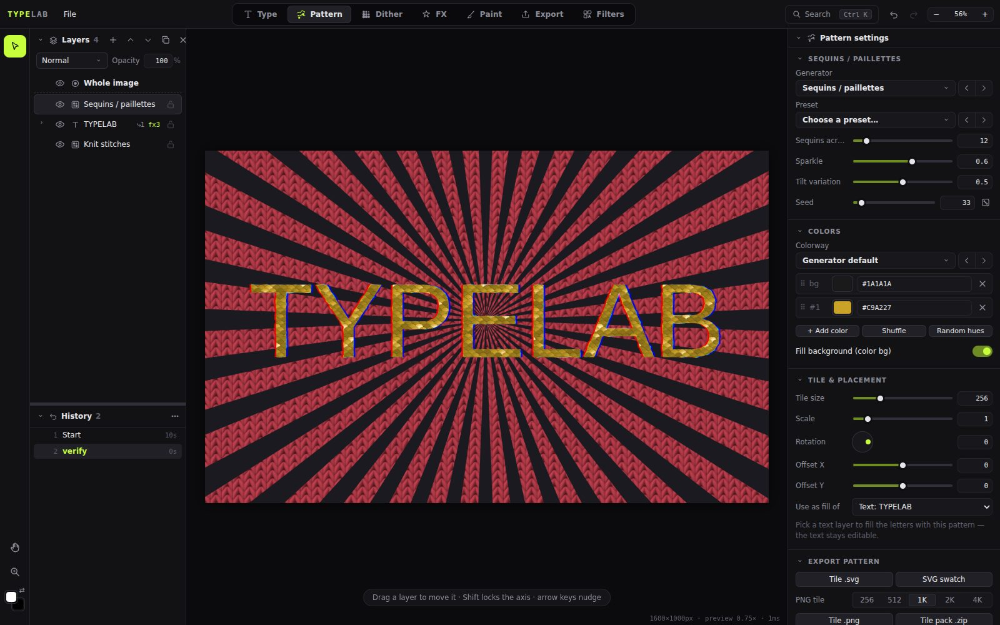

# Integrating texturelib into TypeLab

**Audience:** a Claude Code session working in the **TypeLab** repo (the Electron typography editor,
`app/js/*.js` classic scripts, global `window.TL`). This repo (`helium0o/patterngen`) contains the
pattern library **texturelib** plus a ready-made, tested TypeLab adapter. You do not need to understand
the library internals to integrate it. Read the TL;DR, run it, then skim the rest when you need it.



## TL;DR: 5 steps

Run from the TypeLab repo root, with this repo cloned next to it as `../patterngen`:

```bash
git clone -b claude/keen-ritchie-qy7bl3 https://github.com/Helium0o/patterngen ../patterngen   # once (or git -C ../patterngen pull)
node ../patterngen/integrations/typelab/install.mjs .                       # copy 3 files + small edits (idempotent)
NODE_PATH=$(npm root -g) node ../patterngen/integrations/typelab/verify-in-typelab.mjs app/index.html   # 13 checks in headless Chromium
npm start                                                                    # Pattern workspace → "Fabrics · woven" etc.
npm run dist                                                                 # rebuild the .exe (electron-builder packages app/**/*)
```

- Branch: the library lives on `claude/keen-ritchie-qy7bl3` (`main` only has the initial commit until that
  branch is merged; after a merge, clone `main`). A cloud session attaches the repo with `add_repo`
  (`helium0o/patterngen`) and checks out that branch.
- Paths: the verifier lives in **this** repo (`../patterngen/integrations/typelab/`), not in TypeLab.
  `install.mjs` prints the exact verify command with absolute paths when it finishes.
- `install.mjs` prints what it did. Exit code 1 means some edit's anchor wasn't found (TypeLab changed).
  That edit is skipped, not half-applied, and the message says what to change by hand. See
  [Manual install](#manual-install).
- The verifier needs Playwright and Chromium. Install them **globally**
  (`npm i -g playwright && npx playwright install chromium`) and run with `NODE_PATH=$(npm root -g)`,
  so TypeLab's `package.json` doesn't change. It opens `app/index.html` from `file://` like Electron
  does, respects your `TEXTURELIB_TYPELAB` config, and writes its screenshot to
  `<os temp dir>/typelab-verify/`, never into TypeLab.
- **Can't run `npm start`?** (no Electron or display, e.g. a cloud session): the verifier is the
  substitute. It loads the same `app/index.html` in Chromium and exercises the real code paths. Ask the
  user to click through *Pattern → New pattern → Fabrics · woven* and run `npm run dist` on their machine.
- `dist/` is committed in this repo, so you don't need to build texturelib. If you change texturelib,
  run `npm run build` in this repo, then rerun `install.mjs`.

**Commit in TypeLab:** `app/js/vendor/texturelib.js`, `app/js/vendor/texturelib.worker.js`,
`app/js/texturelib-typelab.js`, `app/index.html`, `app/js/ui/mode-pattern.js`. Don't commit
`package.json` / lockfile changes (none are needed). TypeLab's ROADMAP.md says every milestone ends
with a commit; a suggested entry and version bump (2.1.1 → **2.2.0** in `package.json`):

```
- [x] M19 texturelib patterns (v2.2.0): 52 realistic fabric / print / material generators from texturelib
  (helium0o/patterngen) in 5 new Pattern-workspace groups, 123 presets in the preset picker, colours via the
  Colors panel, live view rendered on Web Workers with provisional tiles, exact exports, SVG embeds the tile;
  files app/js/vendor/texturelib*.js + app/js/texturelib-typelab.js; verified with verify-in-typelab.mjs
```

## What TypeLab gains

- **52 raster generators** in the Pattern workspace, in five new gallery groups: *Fabrics · woven*,
  *Fabrics · knit*, *Fabrics · surfaces*, *Prints · geometric*, *Materials · organic*. They include
  realistic weaves (twill, satin, herringbone, houndstooth, glen check, gingham, tartan from any
  threadcount, denim, tweed, any dobby draft), knits (stockinette/rib/seed/garter/brocade, Fair Isle charts, rope and
  braid cables), corduroy, velvet, quilting/puffer, fishnet/tulle, sequins, cross-stitch, eyelet lace,
  shibori/tie-dye, prints (stripes, checks, ditsy florals, chevron, argyle, Truchet, seigaiha, ogee,
  Islamic stars, terrazzo, halftone, contours, bricks, grid paper) and materials (marble, granite, wood,
  parquet, leopard/jaguar/cheetah, giraffe, zebra/tiger, python/croc, camo, reaction–diffusion, Voronoi,
  leather). The full list with every param is in [PATTERNS.md](PATTERNS.md). Visual overview:
  `previews/sheets/*.jpg`.
- **123 presets** in each generator's existing *Preset* picker (Black Watch, Madras, Aran sweater,
  Nordic snowflake, Calacatta gold, Python, Puffer jacket, …).
- Everything else TypeLab already does with pattern layers keeps working: tile size / scale / rotation /
  offset, **Use as fill of → Text** (texture-filled letters), colourways, Shuffle, Random hues, blend
  modes, effects, dither, history, save/load, PNG tile / tile pack / SVG / full-canvas export.

## How the adapter fits TypeLab

The adapter `integrations/typelab/texturelib-typelab.js` (copied to `app/js/texturelib-typelab.js`)
runs once at load time, after `patterns.js`. It does not edit TypeLab code; it **appends generators to
`TL.patterns.list`** and **wraps three functions** (`PT.items`, `PT.tileCanvas`, `PT.svgBody`) so raster
generators take a different path while TypeLab's vector generators are untouched.

| TypeLab concept | texturelib generator (`g.raster = true`) |
|---|---|
| `g.id` | `'tx-' + patternId`, e.g. `tx-tartan`, `tx-cable-knit`. **Stable: saved documents store it.** |
| `g.cat` | One of the 5 group names above. Change with config, see [Configuration](#configuration). |
| `g.params` | From the texturelib schema: int/float → slider, enum → `type:'select'` (string options), bool → `'bool'`, string → `'text'`, seed → slider with dice (`seed:true`). |
| `g.simple` | Non-advanced params in the easy panel; texturelib's `advanced` params go in the **Advanced** fold. |
| `g.colors` / `L.colors` | All colour params, flattened into slots: background-like params (`background`, `backing`, `fabric`, `base`, `ground`, `paper`) first, then schema order. A variable-length colour list (e.g. dot colours) absorbs extra colours from **+ Add color**. `g.colorLabels[i]` names each slot. |
| `L.bgOn` ("Fill background") | Off = the pattern's `background`/`backing` param becomes `transparent` (real alpha). No effect on patterns without such a param. |
| `g.presets` | texturelib presets: `{ name, p, colors }`. TypeLab applies `p`; install.mjs adds one line so `colors` are applied too. |
| `L.tile`, `L.scale`, `L.rot`, `L.ox/oy`, `L.clipTo` | Handled by TypeLab itself (`PT.draw` + CanvasPattern transform). Default tile 512 doc px. |
| Density | Each pattern has a scale param (`repeats`, `cells`, `stitchesAcross`, `wales`, …) = features per tile. Tile size = how big one tile is. |
| `PT.items(L)` | Returns `{ T, H, items: [] }` (no vector items). |
| `PT.tileCanvas(L, px)` | Renders the tile (see below). |
| `PT.svgBody(L)` | One `<image href="data:image/png;base64,…">` of the tile at ≈2× the tile size (256–2048 px). |
| `PT.tileCanvasAsync(L, px)` | **New.** Exact tile rendered on the workers, resolves to a canvas. Used by PNG tile export. |
| `TL.texturelib` | Debug handle: `{ lib, added, paramsFor(L), colorsFrom(id, params), renderer, clearCache() }`. |

### Rendering path

```
PT.tileCanvas(L, px)
  ├─ cache hit (same pattern + params + colours + px) ............ return canvas
  ├─ not live view (exports, thumbnails, SVG) or px ≤ 192 ......... render synchronously, exact
  └─ live view (TL.view.drawing) and px > 192
       ├─ start a worker render at q = px rounded up to a √2 step (≤ 2048), slot = layer id
       ├─ meanwhile return the closest cached tile (or a 96 px quick render), scaled to px,
       │  and set TL.fx.provisional = true  → TypeLab's layer cache never keeps this frame
       └─ when the worker finishes: cache it, TL.view.request(true)  → next frame is exact
```

This is the same mechanism TypeLab's Embroidery filter uses (`TL.fx.provisional` + `TL.view.drawing`).
Workers come from `app/js/vendor/texturelib.worker.js` (a classic worker that
`importScripts('texturelib.js')`, the same style as `js/dither-worker.js`). The URL is derived from the
`<script src=".../texturelib.js">` tag. Without workers everything still works, on the main thread.
Tile canvases are cached (LRU, ~320 MB budget). The worker renderer has its own cache.

### Saved documents

A layer saves `gen: 'tx-…'`, its params in `L.p` and colours in `L.colors` like any pattern layer.
Output is deterministic: the same params and seed give identical pixels on every machine and every
texturelib version that doesn't announce a breaking change. **Caveat:** TypeLab's loader drops pattern
layers whose generator id is unknown (`state.js`, `pattern: (l) => list.some(...) ? … : null`). Keep the
adapter loaded, and never rename the `tx-` prefix or pattern ids.

## Files

| from this repo | to TypeLab | what |
|---|---|---|
| `dist/texturelib.js` | `app/js/vendor/texturelib.js` | the library (classic script, defines `window.TextureLib`, ~190 KB, readable) |
| `dist/texturelib.worker.js` | `app/js/vendor/texturelib.worker.js` | classic worker for background renders |
| `integrations/typelab/texturelib-typelab.js` | `app/js/texturelib-typelab.js` | the adapter |
| `integrations/typelab/typelab-ui.patch` | reference only | the exact edits `install.mjs` makes (git-apply-able against TypeLab `d4c0832`) |

## Manual install

Use this if `install.mjs` reports a missing anchor.

1. Copy the three files from the table above.
2. `app/index.html`: right after `<script src="js/patterns.js"></script>` add
   ```html
   <script src="js/vendor/texturelib.js"></script>
   <script src="js/texturelib-typelab.js"></script>
   ```
   They must come after `patterns.js` and before `ui/*.js` and `main.js`.
3. Optional but recommended, in `app/js/ui/mode-pattern.js`:
   - preset picker `onChange`, after `L.p = Object.assign(PT().defaults(L.gen).p, pr.p, keep);`:
     `if (pr.colors && pr.colors.length) L.colors = pr.colors.slice();`
   - `colorsSection`: give the `'bg' / '#'+i` label span `title: g.colorLabels ? g.colorLabels[i] || '' : ''`
   - `exportSection`: `const pngTile = async (px) => { const c = U.cloneCanvas(PT().tileCanvasAsync ? await PT().tileCanvasAsync(L, px) : PT().tileCanvas(L, px)); return U.canvasToBlob(c); };`
     Without this, a 4K PNG export of a heavy pattern renders on the UI thread (can take ~10–60 s).

## Configuration

Set this before `texturelib-typelab.js` loads, e.g. in an inline `<script>` placed just before its tag
in `app/index.html`:

```html
<script>window.TEXTURELIB_TYPELAB = { include: ['tartan', 'denim', 'knit', 'velvet', 'marble'], categories: { woven: 'Weaves', knit: 'Knits' } };</script>
<script src="js/texturelib-typelab.js"></script>
```

| option | default | meaning |
|---|---|---|
| `workers` | 3 | background render workers (0 = main thread only) |
| `workerUrl` | derived from the `texturelib.js` script tag | URL of `texturelib.worker.js` |
| `include` | all 52 | only these patterns. **texturelib ids without the `tx-` prefix** (`'tartan'`, not `'tx-tartan'`); see PATTERNS.md |
| `exclude` | none | everything except these (same id format) |
| `categories` | see below | gallery group name per texturelib category. A partial map is **merged** with the defaults. |

| category key (texturelib) | default TypeLab group | patterns |
|---|---|---|
| `woven` | Fabrics · woven | 13 |
| `knit` | Fabrics · knit | 3 |
| `textile` | Fabrics · surfaces | 8 |
| `geometric` | Prints · geometric | 15 |
| `organic` | Materials · organic | 13 |

⚠ Removing a pattern later (via `include`/`exclude` or by dropping the adapter) makes TypeLab **drop
those layers** when it opens documents that use them (see [Saved documents](#saved-documents)). Decide
the set before users save files with it, and only ever add patterns afterwards. The verifier adapts to
`include`/`exclude`.

TypeLab already has vector generators called Houndstooth, Gingham, Plaid, Herringbone, Leopard, Zebra,
Camo, Polka, Halftone, Stripes, Checker, Chevron, Argyle, Truchet, Terrazzo, Topographic and Voronoi.
The texturelib ones have different ids (`tx-…`) and sit in their own groups, so nothing clashes. They are
the *realistic* (shaded, raster) versions. Vector ones stay best for SVG output. If the duplication is
unwanted, `exclude` the texturelib copies.

## Performance

At 512×512 with full quality (supersample 2, one core): most patterns take 0.1–0.9 s. The heavy ones
(giraffe, leopard, marble, leather, voronoi, reaction–diffusion, camouflage, terrazzo, granite) take
1–3 s. See `previews/timings.json`. In TypeLab the live view splits a tile across 3 workers, previews at
quantised sizes, caches everything, and only re-renders when params, colours or tile pixel size change.
Thumbnails (≤ 192 px) render synchronously at 1 sample per pixel: tens of ms each.

## Known limitations

- **Raster only.** SVG exports embed a PNG of the tile. TypeLab's own vector generators remain the
  choice for pure-vector output.
- Live view never renders tiles bigger than 2048 px (it upscales past that). Exports render exact sizes.
- `reaction-diffusion` runs a simulation the first time a param set is used (≈1–2 s, then cached per
  worker).
- TypeLab's colour fields have no alpha. Transparency comes from **Fill background: off**, which
  only affects patterns with a `background`/`backing` param.

## Ideas for deeper integration (not done)

- **Material maps → effects:** `TextureLib.renderMaps(id, opts)` returns colour, height and a tangent-space
  normal map in one pass. Those could drive an emboss/bevel/lighting GL effect on text (TypeLab already
  has a WebGL2 effect stack in `gl.js`/`effects.js`).
- **Texture brush:** use `PT.tileCanvas` output as a CanvasPattern in the Paint workspace.
- **Pattern swatches in the Type inspector:** a "Fill with texture" shortcut that creates a `tx-`
  pattern layer with `clipTo` set to the selected text (that's what *Use as fill of* does today).

## Troubleshooting

| symptom | cause / fix |
|---|---|
| Console: `texturelib-typelab: needs TL.patterns … and window.TextureLib` | Script order: `texturelib.js` and the adapter must load after `patterns.js`. |
| Generators appear but live view stays blurry | Workers failed to load: check `app/js/vendor/texturelib.worker.js` exists next to `texturelib.js`. Console shows `texturelib worker error`. Set `workers: 0` to confirm the main-thread path works. |
| Old documents lose `tx-` layers | The adapter wasn't loaded when the file was opened (see [Saved documents](#saved-documents)). |
| A preset changes params but not colours | The optional `pr.colors` line in `mode-pattern.js` isn't applied. |
| Verifier: `Playwright not found` | `npm i -g playwright && npx playwright install chromium`, run with `NODE_PATH=$(npm root -g)`. |
| Need to inspect what a layer renders | In DevTools: `TL.texturelib.paramsFor(TL.cur())`, or render it yourself: `TextureLib.render('tartan', { width: 256, params })`. |

## Where to look in this repo

- [INTEGRATION.md](INTEGRATION.md): the library API and recipes for any JavaScript app.
- [PATTERNS.md](PATTERNS.md): every pattern, param, range and preset (generated).
- [CLAUDE.md](CLAUDE.md): how the library is built and how to add or modify patterns.
- `integrations/typelab/`: adapter, installer, verifier, patch, screenshot.
- [TYPELAB_HANDOFF.md](TYPELAB_HANDOFF.md): everything in one place for a TypeLab session: every fix, plus
  new pattern ideas with formulas, prototypes (`ideas/`) and TypeLab-side recipes (knit or weave the user's text).
